# SmartScan Stay — Enterprise AI Concierge & Digital Guidebook

<div align="center">


**Ултралек, полиглотен дигитален консиерж и интерактивен наръчник за краткосрочни наеми (Airbnb, вили, бутикови къщи за гости).**

[Архитектурна спецификация](file:///d:/myProjects/smart_scan/AGENTS.md) · [Проектен план (ROADMAP)](file:///d:/myProjects/smart_scan/ROADMAP.md) · [Документационен център](file:///d:/myProjects/smart_scan/docs/README.md) · [Дизайн спецификации](file:///d:/myProjects/smart_scan/design/00_master_tokens.md)

</div>

---

## 📖 Съдържание
1. [Мисия и продуктова визия](#-мисия-и-продуктова-визия)
2. [Архитектура на системата](#-архитектура-на-системата)
3. [Ключови инженерни предимства](#-ключови-инженерни-предимства)
4. [Технологичен стек](#-технологичен-стек)
5. [Инсталация и локално стартиране](#-инсталация-и-локално-стартиране)
6. [Променливи на средата (.env)](#-променливи-на-средата-env)
7. [Файлова и модулна структура](#-файлова-и-модулна-структура)
8. [Сигурност и стандарти](#-сигурност-и-стандарти)
9. [Тестване и проверка на качеството](#-тестване-и-проверка-на-качеството)
10. [Екипен наръчник и документация](#-екипен-наръчник-и-документация)

---

## 🎯 Мисия и продуктова визия

Традиционните хартиени наръчници за имоти са остарели, трудни за актуализация и неразбираеми за чуждестранните гости. **SmartScan Stay** решава този проблем чрез пресечната точка на физически дизайн и авангарден генеративен изкуствен интелект:

1. **Физически контакт**: Гостът намира стилна акрилна табелка с QR код на видно място в обекта (до входната врата или на холна масичка).
2. **Мигновен PWA достъп**: Сканирането на QR кода моментално отваря мобилно приложение (`/stay/[slug]`) в браузъра за **под 200 ms** — без нужда от сваляне от App Store или Google Play и без регистрации.
3. **1-Click достъп до критични данни**: Копиране на Wi-Fi парола с хаптична вибрация, точен адрес за таксиметровия шофьор, обаждане на местно такси, WhatsApp контакт с хазяина и SOS 112 бутон.
4. **24/7 Полиглотен AI Консиерж**: Интелигентен чат асистент на базата на **Gemini 2.5 Flash**, който отговаря на езика на госта (поддържа 50+ езика) само за секунди, използвайки единствено проверените данни от хазяина.

### 🌐 Универсална абстракция за мащабиране
Архитектурата работи **единствено с абстракцията `space`** (`spaces` таблица и `space_id`). Добавянето на нови вертикали не налага промени в базата данни или RAG пайплайна:
- 🏡 **SmartScan Stay** (Airbnb / вили): €9 / месец на обект (със сезонно паузиране).
- 🍽️ **SmartScan Menu** (Ресторанти / барове): Дигитално меню с алергени и препоръки.
- 🏢 **SmartScan RealEstate** (Имоти за продажба): Виртуални брокерски наръчници.

---

## 🏗️ Архитектура на системата

Платформата е изградена по строга модулна архитектура с разделение на клиентския интерфейс, прокси слоя, асинхронния AI бекенд и векторната база данни:

```mermaid
sequenceDiagram
    autonumber
    actor Guest as Гост (Смартфон)
    participant PWA as Next.js 16 PWA (/stay/[slug])
    participant Proxy as No-Middleware Proxy (proxy.ts)
    participant FastAPI as FastAPI Backend (Port 8000)
    participant LangGraph as LangGraph StateGraph
    participant Supabase as Supabase (Postgres + pgvector)
    participant Gemini as OpenRouter (Gemini 2.5 Flash)

    Guest->>PWA: Сканира физически QR код
    PWA->>Supabase: Сървърно зареждане на настройките (DAL: React cache)
    Supabase-->>PWA: Име, Wi-Fi, часове, SOS контакти
    PWA-->>Guest: Рендира Ultra-light PWA HTML (<200ms)

    Note over Guest,PWA: 1-Click Wi-Fi (useHaptic вибрация)

    Guest->>PWA: Задава въпрос: "Къде да изхвърля боклука?"
    PWA->>Proxy: POST /api/py/concierge/chat
    Note over Proxy: Скрабване на x-* хедъри (CVE-2025-29927)<br/>Инжектиране на верифициран Client IP<br/>Предаване на req.signal за бърз Abort
    Proxy->>FastAPI: Проксиране към http://127.0.0.1:8000
    FastAPI->>FastAPI: SlowAPI Rate Limiting (30 req / 10 min)

    rect rgb(24, 24, 27)
        Note over LangGraph: ВЪЗЕЛ 1: sanitize_node<br/>0ms Regex филтриране на системни тагове
        LangGraph->>Supabase: ВЪЗЕЛ 2: retrieve_rag_node<br/>Векторно търсене (WHERE space_id = :id)
        Supabase-->>LangGraph: Фрагменти от наръчника
        Note over LangGraph: XML екраниране в <property_context><br/>Полиглотен системен промпт
        LangGraph->>Gemini: ВЪЗЕЛ 3: generate_stream_node<br/>HTTP/2 SSE Streaming
    end

    loop SSE Токен Стрийминг
        Gemini-->>LangGraph: Token delta
        LangGraph-->>FastAPI: StreamWriter
        FastAPI-->>Proxy: data: {"content": "token"}\n\n
        Proxy-->>PWA: ReadableStream токени
        PWA-->>Guest: Токен-по-токен визуализация в UI
    end

    Gemini-->>LangGraph: [DONE]
    LangGraph-->>FastAPI: Затваряне на стрийма
    FastAPI-->>Proxy: data: [DONE]\n\n
    Proxy-->>PWA: Финализиране & хаптичен пулс
```



---

## ⚡ Ключови инженерни предимства

### 1. Zero-Image PWA архитектура (<200ms зареждане)
- Интерфейсът за гости не зарежда нито едно тежко растерно изображение.
- Използва 100% SVG вектори (Lucide Icons) и съвременна типография (`Space Grotesk`, `Manrope`, `JetBrains Mono`).
- Пълно зареждане дори при слаба 3G връзка на отдалечени планински или морски локации.

### 2. Тактилна хаптична обратна връзка
- Всички критични бутони за копиране (Wi-Fi парола, адрес за такси, код за ключ) задействат фина физическа вибрация (`navigator.vibrate(50)`) през хука `useHaptic`.

### 3. Защита от Prompt Injection с нулева латентност
- **Без бавен междинен модел**: Заявките не минават през втори проверяващ LLM, спестявайки латентност и удвоени разходи.
- **Regex почистване**: `TAG_SANITIZER_REGEX` в Python моментално премахва опити за инжектиране на системни тагове.
- **XML изолация**: Всички динамични данни от имота се екранират (`xml_escape`) и се затварят в `<property_context>`.

### 4. No-Middleware сигурност (Защита от CVE-2025-29927)
- Проектът спазва **строго правило без `middleware.ts`**.
- Всички прокси заявки се валидират в `src/lib/proxy.ts`, като се филтрират всички външни хедъри, започващи с `x-` (по-специално `x-middleware-subrequest`).
- Защитата на `/dashboard` е дублирана на ниво Server Component през Data Access Layer (DAL) и бисквитки от `@supabase/ssr`.

### 5. Двуслойна многоезичност (Dual-Layer Localization)
- **Платформа и UI**: 10 официални езика (`EN`, `BG`, `RO`, `EL`, `RU`, `TR`, `DE`, `ES`, `IT`, `FR`) чрез `next-intl` с автоматично разпознаване по `Accept-Language` (RFC 7231).
- **AI Консиерж**: Универсален полиглот (50+ езика). Гостът задава въпроси на своя роден език (напр. иврит, полски, японски), а моделът отговаря на същия език, превеждайки инструкциите на хазяина в движение.

### 6. Спиране на токените при отказ (AbortSignal)
- При натискане на бутона "Stop" или затваряне на браузъра, фронтендът активира `AbortController`, който през `proxy.ts` прекъсва сокета към Gemini Flash, предотвратявайки таксуване на ненужни токени.

---

## 🛠️ Технологичен стек

| Компонент | Технологии & Библиотеки | Предназначение |
| :--- | :--- | :--- |
| **Frontend Core** | Next.js 16 (App Router), React 19, TypeScript 5.x | Реактивен UI, Server Components, SSR & PWA |
| **Стилизация** | Tailwind CSS v4, Obsidian Luxury Design System | Модерни градиенти (`bg-linear-to-*`), тъмен бутиков интерфейс |
| **i18n & Локализация** | `next-intl`, RFC 7231 Parser | 10 поддържани езикови локала, бисквиткова синхронизация |
| **Икони & Шрифтове** | Lucide React, Google Fonts (`Space Grotesk`, `Manrope`) | Векторен интерфейс, нулево тегло |
| **Backend Core** | Python 3.12, FastAPI, Uvicorn, Pydantic v2 | Високопроизводително асинхронно REST/SSE API |
| **AI Orchestration** | LangGraph (`StateGraph`), OpenRouter API | Модулен AI пайплайн, поточен SSE стрийминг с Gemini 2.5 Flash |
| **Rate Limiting** | SlowAPI, Limits | Защита от претоварване (30 заявки / 10 мин) |
| **База данни & Вектори** | Supabase, PostgreSQL 15, `pgvector` | HNSW индекс (1536 измерения), Row Level Security (RLS) |
| **Пакетни мениджъри** | `npm` (Node.js), `uv` (Python) | Детерминистично и светкавично инсталиране на зависимости |

---

## 🚀 Инсталация и локално стартиране

### Предварителни изисквания
- **Node.js** v20.x или по-нова версия.
- **Python** 3.12 или по-нова версия.
- **uv** (Препоръчителен ултрабърз Python пакетен мениджър):
  ```bash
  # Инсталация на uv (Windows PowerShell):
  powershell -ExecutionPolicy ByPass -c "irm https://astral.sh/uv/install.ps1 | iex"
  ```
- **Supabase** профил с активиран `pgvector`.

---

### 1. Клониране на хранилището
```bash
git clone https://github.com/Krasimir-Hristov/SmartScan.git
cd smart_scan
```

---

### 2. Настройка и стартиране на Бекенда (FastAPI)
```bash
cd backend

# Създаване на виртуална среда и синхронизиране на пакетите
uv sync

# Копиране на примерните променливи на средата
cp .env.example .env
# Попълнете OPENROUTER_API_KEY, SUPABASE_URL и SUPABASE_SECRET_KEY в .env

# Стартиране на Uvicorn dev сървъра на порт 8000
uv run uvicorn app.main:app --reload --port 8000
```
API документацията (Swagger UI) ще бъде достъпна на: `http://127.0.0.1:8000/docs`.

---

### 3. Настройка и стартиране на Фронтенда (Next.js 16)
В нов терминал:
```bash
cd frontend

# Инсталиране на npm зависимостите
npm install

# Копиране на примерните променливи на средата
cp .env.example .env.local
# Попълнете NEXT_PUBLIC_SUPABASE_URL и NEXT_PUBLIC_SUPABASE_ANON_KEY

# Стартиране на Next.js в режим на разработка
npm run dev
```
Фронтендът ще стартира на: `http://localhost:3000`.

> **Проверки на качеството преди commit:**
> ```bash
> npm run lint
> npm run typecheck   # next typegen + tsc --noEmit
> npm run build
> ```
>
> `npm run typecheck` първо регенерира Next.js route типовете (`.next/types/**`) и след това
> пуска строгата TypeScript проверка. Без първата стъпка на чисто checkout (или след изтрит
> `.next`) се появяват грешки от вида
> `Cannot find module './routes.js'` в `.next/types/validator.ts`, защото `.next/types/**` и
> `next-env.d.ts` са генерирани и не се съхраняват в git.
>
> Ако редакторът показва такива грешки след добавяне/изтриване на route:
> `npm run typecheck` ➔ `Ctrl+Shift+P` ➔ **TypeScript: Restart TS Server**.

---

### 4. Тестване на готовото решение
- **Начална страница**: `http://localhost:3000`
- **Гост PWA (Демо Вила)**: `http://localhost:3000/stay/demo-space-villa-smartscan`
- **Хазяин вход**: Кликнете върху "Вход с Google" или отворете `http://localhost:3000/dashboard`

---

## 🔑 Променливи на средата (.env)

### Backend (`backend/.env`)
```ini
# OpenRouter API (Gemini 2.5 Flash стрийминг)
OPENROUTER_API_KEY="sk-or-v1-..."

# Supabase (PostgreSQL & pgvector RAG)
SUPABASE_URL="https://your-project-id.supabase.co"
SUPABASE_SECRET_KEY="sbp_secret_..."

# Rate Limiting & Environment
ENVIRONMENT="development"
ALLOWED_ORIGINS="http://localhost:3000,http://127.0.0.1:3000"

# Споделена тайна с Next.js проксито (ЗАДЪЛЖИТЕЛНА в production):
# валидира x-internal-auth, за да се доверява бекендът на x-forwarded-for
# (иначе rate limiting-ът работи по socket address — един общ bucket).
BACKEND_PROXY_SECRET="генерирай с: openssl rand -hex 32"
```

### Frontend (`frontend/.env.local`)
```ini
# Supabase Client Credentials
NEXT_PUBLIC_SUPABASE_URL="https://your-project-id.supabase.co"
NEXT_PUBLIC_SUPABASE_PUBLISHABLE_KEY="sbp_publishable_..."

# Internal Backend URL (За No-Middleware проксито proxy.ts)
BACKEND_INTERNAL_URL="http://127.0.0.1:8000"

# Каноничен публичен домейн (кодира се в QR кодовете на физическите табелки).
# ЗАДЪЛЖИТЕЛЕН в production — иначе табелката се маркира като неизползваема.
# Само в development при липса се ползва валидираният request host.
NEXT_PUBLIC_SITE_URL="https://smartscan.stay"

# Споделена тайна с FastAPI бекенда — СЪЩАТА стойност като BACKEND_PROXY_SECRET
# в backend/.env (server-only, никога с NEXT_PUBLIC_ префикс).
BACKEND_PROXY_SECRET="генерирай с: openssl rand -hex 32"
```

---

## 📂 Файлова и модулна структура

Проектът следва стриктна **Feature-Based архитектура** както във фронтенда, така и в бекенда:

```text
smart_scan/
├── .agents/                        # Персонализирани AGY умения (fastapi, nextjs, supabase)
├── design/                         # Дизайн спецификации на токени, PWA и компоненти
├── docs/                           # Официален документационен център
│   ├── README.md                   # Главен индекс на документацията
│   ├── authentication.md           # Архитектура на Google OAuth и DAL защитата
│   └── steps/                      # Доклади за изпълнените стъпки
│       ├── step-01-landing-and-i18n.md
│       ├── step-02-host-authentication.md
│       ├── step-03-guest-pwa-experience.md
│       ├── step-04-database-migrations-dal.md
│       └── step-05-fastapi-ai-concierge-proxy.md
│
├── frontend/                       # Next.js 16 (App Router) фронтенд
│   ├── messages/                   # 10 езикови речника (en.json, bg.json, ...)
│   └── src/
│       ├── app/                    # Тънък рутиращ слой
│       │   ├── page.tsx            # Landing page
│       │   ├── layout.tsx          # Root Layout с шрифтове
│       │   ├── auth/callback/      # OAuth Route Handler
│       │   ├── dashboard/          # Защитен Server Component за хазяи
│       │   ├── stay/[slug]/        # Гост PWA страница с динамичен slug
│       │   └── api/py/[...path]/   # No-Middleware прокси рут към FastAPI
│       │
│       ├── features/               # Изолирани бизнес модули (Barrel Exports)
│       │   ├── landing/            # Landing page компоненти (LandingHero, FeaturesGrid...)
│       │   ├── stay/               # Гост преживяване (StayExperience, WifiCard, ConciergeBar...)
│       │   └── dashboard/          # Хазяин табло (DashboardPage, SpacesList...)
│       │
│       ├── components/ui/          # Презентационни UI компоненти (Button, Card, Dialog...)
│       └── lib/                    # Споделена инфраструктура
│           ├── dal.ts              # Data Access Layer ('server-only', React cache)
│           ├── proxy.ts            # Защитен прокси слой (CVE-2025-29927 скрабване)
│           └── supabase/           # Сървърен и клиентски Supabase SDK (@supabase/ssr)
│
├── backend/                        # FastAPI ядро (Python 3.12+)
│   ├── app/
│   │   ├── core/                   # Глобална конфигурация, сигурност и база данни
│   │   │   ├── config.py           # Pydantic v2 настройки
│   │   │   ├── security.py         # Regex защита от Prompt Injection
│   │   │   ├── rate_limit.py       # SlowAPI лимитер
│   │   │   └── database.py         # Supabase Singleton клиент
│   │   │
│   │   ├── features/               # 3-слойна модулна бизнес логика
│   │   │   ├── concierge/          # AI Консиерж (router, service, graph.py)
│   │   │   ├── knowledge/          # RAG извличане и контекст за престоя
│   │   │   ├── spaces/             # Управление на пространствата
│   │   │   └── voice_ingest/       # Whisper аудио обработка (Предстояща)
│   │   │
│   │   └── main.py                 # Входна точка: регистрация на рутери и CORS
│   │
│   ├── tests/                      # Pytest тестове (тестове на графа, сигурността и API)
│   ├── pyproject.toml              # UV зависимости и конфигурация
│   └── requirements.txt            # Стандартен requirements файл
│
├── supabase/                       # Supabase инфраструктура
│   └── migrations/                 # Детерминистични SQL DDL миграции (pgvector, RLS, RPCs)
│
├── AGENTS.md                       # Главен системен архитектурен манифест
└── ROADMAP.md                      # Интерактивен 10-стъпков чек-лист за напредъка
```

---

## 🔒 Сигурност и стандарти

1. **Забрана за `middleware.ts`**: Защита срещу CVE-2025-29927; цялата сигурност се контролира в `proxy.ts` (почистване на `x-*` хедъри) и сървърния DAL слой.
2. **Нулев тип `any`**: 100% строга типизация в TypeScript и Pydantic v2 в Python.
3. **Строга мулти-тенант изолация**: Всички SQL заявки и векторни търсения задължително съдържат `WHERE space_id = :space_id`.
4. **Неблокиращ Event Loop**: Всички синхронни Supabase заявки в Python се изпълняват в нишки през `asyncio.to_thread`.
5. **Защита на системния промпт**: XML екраниране на потребителски данни и строги системни инструкции срещу опити за social engineering и jailbreak.

---

## 🧪 Тестване и проверка на качеството

Проектът разполага с цялостна тестова система за двата слоя:

### Бекенд тестове (Pytest)
```bash
cd backend
uv run pytest -v
```
- `test_security.py` — Тества филтрирането на системни XML тагове и опити за Prompt Injection.
- `test_graph.py` — Тества изпълнението на LangGraph StateGraph, състоянието и RAG извличането.
- `test_api.py` — Тества FastAPI ендпойнта, валидацията на схемите и SlowAPI rate limiting-а.

### Фронтенд проверки (TypeScript & Linter)
```bash
cd frontend

# Проверка на TypeScript типовете без компилация
npx tsc --noEmit

# Проверка на качеството на кода (ESLint)
npm run lint

# Тестов производствен билд
npm run build
```

---

## 📚 Екипен наръчник и документация

За детайлно запознаване с всяка завършена фаза от разработката, разгледайте официалните документи в директория `docs/`:

- [📑 **Пълен индекс на документацията**](file:///d:/myProjects/smart_scan/docs/README.md)
- [🚀 **Стъпка 1: Landing Page & i18n Архитектура**](file:///d:/myProjects/smart_scan/docs/steps/step-01-landing-and-i18n.md)
- [🔐 **Стъпка 2: Host Автентикация & Google OAuth**](file:///d:/myProjects/smart_scan/docs/steps/step-02-host-authentication.md)
- [📱 **Стъпка 3: Гост Мобилно PWA Преживяване**](file:///d:/myProjects/smart_scan/docs/steps/step-03-guest-pwa-experience.md)
- [🐘 **Стъпка 4: База данни, Supabase Миграции & DAL**](file:///d:/myProjects/smart_scan/docs/steps/step-04-database-migrations-dal.md)
- [🤖 **Стъпка 5: FastAPI AI Concierge (LangGraph) & Прокси**](file:///d:/myProjects/smart_scan/docs/steps/step-05-fastapi-ai-concierge-proxy.md)
- [📊 **Интерактивен Roadmap с текущ статус**](file:///d:/myProjects/smart_scan/ROADMAP.md)

---

<div align="center">

Разработено с фокус върху производителността, сигурността и прецизния дизайн за **SmartScan Stay**.

</div>
