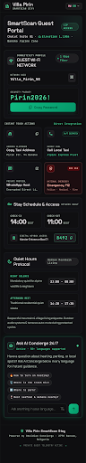
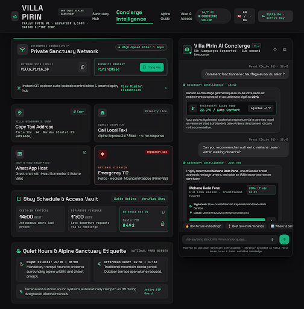

# Design Spec: 01_guest_stay_mobile (Clean & Realistic Guest PWA)

- **Platform**: Mobile-First PWA (iOS Safari / Android Chrome)
- **Aesthetic**: Obsidian High-Tech Luxury
- **Images**: **ZERO PHOTOS / 100% High-Tech Typography + Vector Icons**
- **Host Friction**: Ultra-low (only Wi-Fi, Address, Contacts, Hours & Keybox needed). All nuanced house questions are handled dynamically by the AI Concierge.

---

## Visual Previews

### 1. Mobile PWA View (390px — Primary Guest View)

### 2. Desktop & Tablet Landscape View (1440px)

---

## 1. Color Palette Tokens

| Token | HEX / Value | Role |
|---|---|---|
| `canvas-bg` | `#09090B` | Deep space obsidian canvas background |
| `card-surface` | `#121216` | Frosted smoked glass bento cards |
| `card-border` | `rgba(255, 255, 255, 0.08)` | 1px crisp subtle outline |
| `accent-emerald` | `#10B981` | Cyber Emerald (Active AI, Copy Wi-Fi, Primary Actions) |
| `accent-emergency` | `#EF4444` / `#DC2626` | Emergency SOS border & badge for 112 |
| `text-primary` | `#FFFFFF` | Headings, essential credentials |
| `text-secondary` | `#A1A1AA` | Labels, subtitles |
| `text-muted` | `#71717A` | Hours, secondary badges |

---

## 2. Component Hierarchy

### A. Top Header
- Left: Property Brand (`VILLA PIRIN`).
- Right: Language Switcher pill (`🇬🇧 EN ▾`) supporting the 10 core tourism markets (EN, BG, RO, EL, RU, TR, DE, ES, IT, FR).

### B. #1 Hero Card — 1-Click Wi-Fi
- Network name: `Villa_Pirin_5G`
- Password: `Pirin2026!` in large monospace font
- Action: Big emerald `Copy Password` button (`cursor-pointer`, haptic vibration `navigator.vibrate(50)`).

### C. Fast Action Grid (4 Practical Tiles)
1. 🚗 **Copy Taxi Address**: `Pirin Str. 94, Bansko` + 1-click copy icon.
2. 📞 **Call Local Taxi**: Dedicated local taxi dispatch button.
3. 💬 **WhatsApp Host**: Direct encrypted messaging to host.
4. 🚨 **Emergency 112**: Red SOS alert tile (`Police · Medical · Fire`).

### D. Stay Schedule & Access
- Check-in: `14:00` | Check-out: `11:00`.
- Keybox Code: `8492`.

### E. Quiet Hours Protocol (Часове за тишина)
- **Night Silence**: `23:00 - 08:00`.
- **Afternoon Rest (Siesta)**: `14:30 - 17:30` (essential for Greece, Spain, and Mediterranean quiet regulations).

### F. 24/7 AI Concierge Input Bar
- Header: *Ask AI Concierge 24/7 (50+ languages supported)*.
- Quick Prompt Chips:
  - 🔥 `How to turn on heating?`
  - 🗑️ `Where is the trash bin?`
  - 🅿️ `Where to park?`
  - 🍷 `Best taverns & restaurants nearby?`
- High-tech input field: *„Ask anything in your language...“* with emerald send button.
