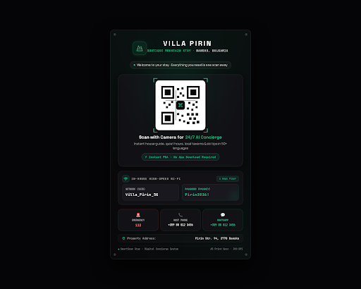

# Design Spec: 02_qr_print_plate (Acrylic Tabletop Print Plate)

- **Platform / Medium**: Physical Acrylic Stand / Print Plaque (A5 / A6 Portrait Format)
- **Aesthetic**: Obsidian High-Tech Luxury (Matching `design/00_design_system`)
- **Print Resolution**: 300+ DPI Vector/High-Contrast Print Spec
- **Target Location**: Bedside table, living room coffee table, or entryway console

---

## Visual Preview

---

## 1. Color Palette Tokens

| Token | HEX / Value | Role |
|---|---|---|
| `plate-canvas` | `#09090B` | Obsidian deep black base plate background |
| `card-surface` | `#121216` | Frosted smoky acrylic inner container cards |
| `card-border` | `rgba(255, 255, 255, 0.08)` | 1px crisp subtle hairline border |
| `accent-emerald` | `#10B981` | Cyber Emerald (QR brackets, brand emblem, active tags) |
| `accent-emergency` | `#EF4444` | Emergency 112 red alert badge |
| `qr-surface` | `#FFFFFF` | Ultra-crisp high-contrast QR code container for instant camera scan |
| `text-primary` | `#FFFFFF` | Property name, Wi-Fi credentials, key headlines |
| `text-secondary` | `#A1A1AA` | Subtitles, instructions, contact labels |
| `text-muted` | `#71717A` | Metadata, print specs, footer system labels |

---

## 2. Component Hierarchy

### A. Plate Header (Brand Identity)
- **Corner Mounts**: 4 subtle corner screw/bolt accents for realistic tabletop acrylic plaque feel.
- **Brand Emblem**: Minimalist mountain icon in Cyber Emerald (`#10B981`) within a rounded container.
- **Property Title**: `VILLA PIRIN` (Bold `Space Grotesk`, uppercase, tracking-wider).
- **Subtitle**: `BOUTIQUE MOUNTAIN STAY · BANSKO, BULGARIA` (Monospace / JetBrains Mono tracking).
- **Welcome Tagline Pill**: `🟢 Welcome to your stay · Everything you need is one scan away`.

### B. Hero QR Code Card (Center Focal Point)
- **Framing**: Frosted glass bento card with Cyber Emerald targeting corner brackets (`[ ]`).
- **QR Code**: Centered high-contrast QR square with embedded center logo mark, readable from 1.5–2 meters.
- **Call to Action**:
  - Primary: **"Scan with Camera for 24/7 AI Concierge"** (`#10B981` emerald accent).
  - Description: *"Instant house guide, quiet hours, local taverns & ski tips in 50+ languages"*.
  - Pill Badge: `⚡ Instant PWA · No App Download Required`.

### C. Fallback Wi-Fi Credentials Bento
- Immediate offline utility for guests right after checking in:
  - Header: 📶 `IN-HOUSE HIGH-SPEED WI-FI` · `1 Gbps Fiber` badge.
  - **Network (SSID)**: `Villa_Pirin_5G`
  - **Password (Passkey)**: `Pirin2026!` (Prominent `JetBrains Mono` font with soft emerald tint).

### D. Direct Emergency & Host Contacts Strip
- 3-tile contact strip:
  1. 🚨 **Emergency**: `112` (Red accent badge).
  2. 📞 **Host Phone**: `+359 88 812 3456`.
  3. 💬 **WhatsApp**: `+359 88 812 3456`.
- **Property Address**: `Pirin Str. 94, 2770 Bansko` (with location pin).

### E. Print Plate Footer
- Left: `SmartScan Stay · Digital Concierge System`
- Right: `A5 Print Spec · 300 DPI`

---

## 3. Frontend & Print Implementation Notes (`@react-pdf/renderer`)
- When rendered in the Host Dashboard (`design/03_host_dashboard`) for printing:
  - Output formats supported: **A5 (148 x 210 mm)** and **A6 (105 x 148 mm)**.
  - High-resolution SVG QR code generation (client-side dynamic).
  - Both **Dark Obsidian Luxury** (as shown above) and **High-Contrast Light/Paper-friendly** versions will be available for hosts without dark acrylic printing capabilities.
