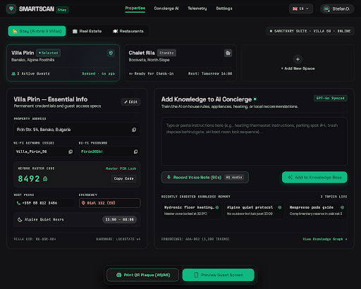

# Design Spec: 03_host_dashboard (Minimalist Host Dashboard & Space Manager)

- **Platform**: Desktop Web Control Panel (1440px desktop optimized)
- **Aesthetic**: Obsidian High-Tech Luxury (Clean Linear/Vercel-inspired boutique UX)
- **Philosophy**: Zero clutter, instant visibility of spaces, essential credentials form, and 2-way AI knowledge ingestion (Text + Voice)

---

## Visual Preview

---

## 1. Color Palette & Surface Tokens

| Token | HEX / Value | Role |
|---|---|---|
| `dashboard-bg` | `#09090B` | Deep obsidian base canvas |
| `card-surface` | `#121216` | Clean frosted glass containers |
| `card-border` | `rgba(255, 255, 255, 0.08)` | 1px subtle hairline container boundary |
| `accent-emerald` | `#10B981` | Cyber Emerald (Active vertical pill, Selected space border, Add button) |
| `text-primary` | `#FFFFFF` | Headings, credentials, labels |
| `text-secondary` | `#A1A1AA` | Subtitles, instructions, secondary fields |
| `text-muted` | `#71717A` | Metadata, tags |

---

## 2. Component Hierarchy

### A. Clean Minimal Navbar
- Left: `SMARTSCAN Stay` logo with emerald emblem.
- Center: `Properties` (Active emerald underline), `Concierge AI`, `Telemetry`, `Settings`.
- Right: Language selector (`🇬🇧 EN ▾`) and Host Profile avatar (`Stefan D.`).
- *No complex status bars, no ugly clutter.*

### B. Vertical Category Switcher (Top Pills)
- 🏡 **`Stay (Airbnb & Villas)`** [Active solid Cyber Emerald pill]
- 🏢 **`Real Estate`** [Inactive dark pill]
- 🍽️ **`Restaurants`** [Inactive dark pill]
- Right status indicator: `🟢 Sanctuary Suite · Villa 08 · Online`.

### C. Spaces List for Selected Vertical (`Stay`)
- **Card 1 (`Villa Pirin`)**: `Selected` badge, emerald border, location `Bansko, Alpine Foothills`, `2 Active Guests`.
- **Card 2 (`Chalet Rila`)**: `Standby` badge, `Borovets, North Slope`, `Ready for Check-in`.
- **Card 3 (`+ Add New Space`)**: Dotted border card for 1-click addition of new properties.

### D. Active Property Management Surface (`Villa Pirin`)

#### Left Column: Essential Property Info (Form / Card)
- **Address**: `Pirin Str. 94, Bansko, Bulgaria` (with copy icon).
- **Wi-Fi**: `Villa_Pirin_5G` / `Pirin2026!` (with copy icon).
- **Keybox Master Code**: `8492` (with `Copy Code` button).
- **Contacts**: Host `+359 88 812 3456` | Emergency `Dial 112 (EU)`.
- **Quiet Hours**: `23:00 - 08:00`.
- Top action: `Edit` button to update credentials anytime.

#### Right Column: Add Knowledge to AI Concierge (Text & Voice)
- Subtitle: *Train the AI on house rules, appliances, heating, or local recommendations.*
- **Textarea Input**: Clean, spacious text box for typing or pasting rules (heating instructions, parking spot #4, trash disposal behind gate, ski boot room lock).
- **Dual Ingestion Actions**:
  - 🎙️ `Record Voice Note (60s)` [HQ Audio] button.
  - ✨ `Add to Knowledge Base` (Primary solid Cyber Emerald button).
- **Recent Knowledge Chips**: `Hydronic floor heating` (22.5°C), `Alpine quiet protocol` (No hot tub post 23:00), `Nespresso pods guide` (Cabinet 2).

### E. Bottom Action Bar
- 🖨️ **Print QR Plaque (A5/A6)** (Emerald outline button).
- 📱 **Preview Guest Screen** (Solid Cyber Emerald button).
