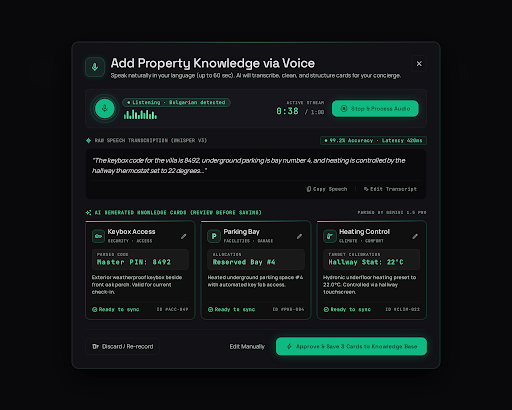
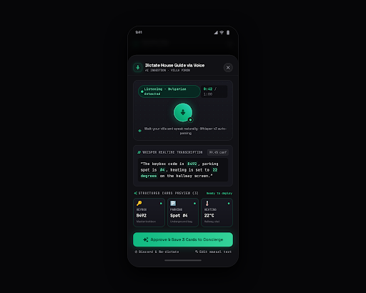

# Design Spec: 04_host_voice_ingest (Host Voice Note Ingest & Knowledge Approval Modal)

- **Platform**: Desktop Web Modal Dialog (Centered overlay over Dashboard)
- **Aesthetic**: Obsidian High-Tech Luxury (Matching `design/00_design_system`)
- **Primary Function**: Frictionless voice-to-vector ingestion (MediaRecorder API -> Whisper -> Gemini Flash structuring -> pgvector embeddings)
- **Target User**: Host walking through property dictating house instructions in native language (Bulgarian, English, etc.)

---

## Visual Previews

### 1. Desktop Modal View (1440px)

### 2. Mobile Bottom Sheet View (390px)

---

## 1. Color Palette Tokens

| Token | HEX / Value | Role |
|---|---|---|
| `modal-backdrop` | `rgba(9, 9, 11, 0.85)` | Deep space obsidian backdrop with CSS backdrop-filter blur |
| `modal-surface` | `#121216` | Frosted dark glass container |
| `card-border` | `rgba(255, 255, 255, 0.08)` | Crisp 1px hairline boundary |
| `accent-emerald` | `#10B981` | Cyber Emerald (Recording pulse, soundwave, Primary CTAs) |
| `accent-glow` | `rgba(16, 185, 129, 0.2)` | Radial glow for active mic & approval buttons |
| `text-primary` | `#FFFFFF` | Headings, extracted card values, timers |
| `text-secondary` | `#A1A1AA` | Subtitles, transcription quotes, card descriptions |
| `text-muted` | `#71717A` | Metadata, latency, IDs |

---

## 2. Component Hierarchy & Workflow

### A. Modal Header
- Left: Glowing Cyber Emerald microphone emblem within a rounded square.
- Title: **"Add Property Knowledge via Voice"** (Space Grotesk).
- Subtitle: *"Speak naturally in your language (up to 60 sec). AI will transcribe, clean, and structure cards for your concierge."*
- Right: Dismiss button (`✕`).

### B. Live Audio Recording Bar
- **Mic Button**: Circular button with pulsating emerald ring and active microphone icon.
- **Audio Visualizer**: Live multi-bar equalizer animation indicating active speech input.
- **Language Detection**: `🟢 Listening · Bulgarian detected` (automatic language classification).
- **Timer Countdown**: `0:38 / 1:00` (Strict 60-second limit enforced per `AGENTS.md`).
- **Control**: `Stop & Process Audio` (Solid Cyber Emerald button).

### C. Raw Speech Transcription Box (Whisper)
- Header: `RAW SPEECH TRANSCRIPTION (WHISPER V3)` · `99.2% Accuracy · Latency 420ms`.
- Content: Clean quoted transcript: *"The keybox code for the villa is 8492, underground parking is bay number 4, and heating is controlled by the hallway thermostat set to 22 degrees..."*
- Utilities: `Copy Speech` | `Edit Transcript`.

### D. AI-Structured Knowledge Cards Preview (Gemini)
- Header: `AI GENERATED KNOWLEDGE CARDS (REVIEW BEFORE SAVING)` · `PARSED BY GEMINI`.
- 3 Structured Bento Cards:
  1. 🔑 **Keybox Access** (`SECURITY · ACCESS`):
     - Parsed Code: `Master PIN: 8492`
     - Description: Exterior weatherproof keybox beside front oak porch. Valid for current check-in.
     - Status: `🟢 Ready to sync`.
  2. 🅿️ **Parking Bay** (`FACILITIES · GARAGE`):
     - Allocation: `Reserved Bay #4`
     - Description: Heated underground parking space #4 with automated key fob access.
     - Status: `🟢 Ready to sync`.
  3. 🌡️ **Heating Control** (`CLIMATE · COMFORT`):
     - Target Calibration: `Hallway Stat: 22°C`
     - Description: Hydronic underfloor heating preset to 22.0°C. Controlled via hallway touchscreen.
     - Status: `🟢 Ready to sync`.

### E. Modal Footer Actions
- Left: `Discard / Re-record` (Muted border button).
- Center: `Edit Manually` (Opens quick card editor).
- Right: **`✨ Approve & Save 3 Cards to Knowledge Base`** (Solid glowing Cyber Emerald button).
