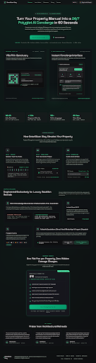
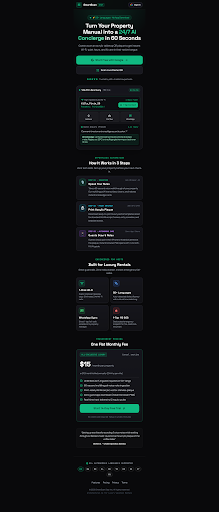

# Design Spec: 05_landing_auth (Marketing Landing Page & Host Auth)

- **Platforms**: Desktop Web (1440px+) & Mobile Responsive (390px iOS/Android)
- **Aesthetic**: Obsidian High-Tech Luxury (Matching `design/00_design_system`)
- **Target Audience**: Property hosts, Airbnb managers, villa owners, boutique hotel operators
- **Primary Goal**: High-converting visitor funnel explaining the 3-step value prop with 1-click Google OAuth authentication

---

## Visual Previews

### 1. Desktop View (1440px)

### 2. Mobile Responsive View (390px)

---

## 1. Color Palette Tokens

| Token | HEX / Value | Role |
|---|---|---|
| `landing-bg` | `#09090B` | Deep space obsidian canvas background |
| `card-surface` | `#121216` | Frosted dark glass bento containers |
| `card-border` | `rgba(255, 255, 255, 0.08)` | Crisp 1px hairline container borders |
| `accent-emerald` | `#10B981` | Cyber Emerald (Primary CTAs, conversion buttons, active pills) |
| `accent-glow` | `rgba(16, 185, 129, 0.2)` | Radial hero backglow and button glow |
| `text-primary` | `#FFFFFF` | Hero headlines, value propositions, pricing figures |
| `text-secondary` | `#A1A1AA` | Descriptions, subtitles, benefit points |
| `text-muted` | `#71717A` | Disclaimers, copyright, legal links |

---

## 2. Component Hierarchy & Flow

### A. Navigation Bar
- **Brand Identity**: `SmartScan Stay` with Cyber Emerald mountain emblem.
- **Desktop Links**: `Features`, `How It Works`, `Showcases`, `Pricing`, `Testimonials`.
- **Right Utilities**:
  - 10-Language Selector (`🇬🇧 EN ▾`).
  - **`Sign in with Google`** (High-visibility dark pill button with Google 'G' icon for frictionless 1-click host login).

### B. Hero Section
- **Eyebrow Pill**: `⚡ NEXT-GEN HOSPITALITY AI · 50+ LANGUAGES DETECTED`.
- **Main Headline**: **"Turn Your Property Manual into a 24/7 Polyglot AI Concierge in 60 Seconds"** (Bold `Space Grotesk`).
- **Subtitle**: *"Guests scan an acrylic tabletop QR plaque with any smartphone camera. Zero app download required. Instant Wi-Fi connection, quiet hours, local dining secrets, and multilingual AI assistance."*
- **Dual Conversion CTAs**:
  - Primary: `Start Free with Google ➔` (Solid Cyber Emerald button).
  - Secondary: `Scan Live Demo QR` (Frosted glass outline button).
- **Hero Showcase**:
  - Desktop: Side-by-side showcase of the A5 Obsidian QR Plaque (`Villa Pirin`) and the instant Mobile PWA Concierge Interface.
  - Mobile: Clean centered card preview of the 1-click Wi-Fi guest screen.

### C. Live Proof Metrics Strip
- `98.4% Auto-Resolution` (Guest questions answered without calling host).
- `1.12s Response Velocity` (Instant streaming response).
- `50+ Native Languages` (Polyglot AI automatically detects guest language).
- `48 hrs Host Setup` (Zero coding required).

### D. How SmartScan Stay Works (3-Step Bento)
1. 🎙️ **Step 1: Speak or Type Your Rules**:
   - Dictate 60-second voice notes while inspecting the property or paste existing manuals. AI structures the cards.
2. 🖨️ **Step 2: Print Your Acrylic Plaque**:
   - Download vector-ready 300 DPI A5/A6 acrylic plate designs for bedroom & tabletop stands.
3. 📱 **Step 3: Guests Scan & Relax**:
   - Universal mobile PWA opens with zero installation, answering queries in the guest's native tongue 24/7.

### E. Feature Bento Highlights
- 🧠 **Voice-to-Knowledge AI & Card Structuring**: MediaRecorder + Whisper + Gemini Flash pipeline.
- 📶 **Instant 1-Click Wi-Fi**: Haptic feedback copy + QR scanner.
- 🌍 **Polyglot Polymath (10 Hard Locales + 50+ AI Languages)**: Full localization for major European markets.
- 💬 **Automated Escalation**: Direct WhatsApp host link and urgent 112 dispatch.

### F. Transparent Pricing Bento
- **Single Flat Tier**: `$15 / month per property`.
- Included: Unlimited AI guest chats, voice note transcription, vector knowledge base, vector-ready plaque export, all 10 UI languages.
- CTA: `Start Free 14-Day Trial ➔` (No credit card required upfront).

### G. Multilingual Global Footer
- **10 Core Localizations**: Pills for 🇬🇧 `EN`, 🇧🇬 `BG`, 🇷🇴 `RO`, 🇬🇷 `EL`, 🇷🇺 `RU`, 🇹🇷 `TR`, 🇩🇪 `DE`, 🇪🇸 `ES`, 🇮🇹 `IT`, 🇫🇷 `FR`.
- Legal, Privacy Policy, Terms of Service, and Copyright `SmartScan Stay`.
