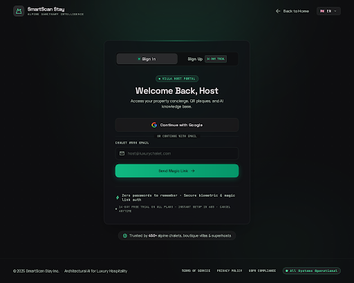
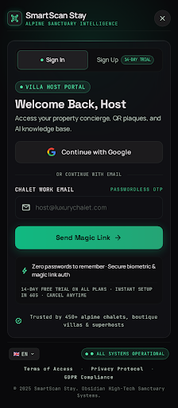

# Design Spec: 06_host_auth (Host Sign In & Sign Up Authentication)

- **Platforms**: Desktop Web (1440px+) & Mobile Responsive (390px iOS/Android)
- **Aesthetic**: Obsidian High-Tech Luxury (Matching `design/00_design_system`)
- **Primary Method**: 1-Click Google OAuth (Supabase Auth) + Passwordless Magic Email Link
- **Target User**: Property hosts, villa managers, and real estate hosts signing in or starting a 14-day free trial

---

## Visual Previews

### 1. Desktop View (1440px)

### 2. Mobile Responsive View (390px)

---

## 1. Color Palette Tokens

| Token | HEX / Value | Role |
|---|---|---|
| `auth-bg` | `#09090B` | Deep space obsidian canvas background |
| `card-surface` | `#121216` | Frosted dark glass container with subtle blur |
| `card-border` | `rgba(255, 255, 255, 0.08)` | Crisp 1px hairline border |
| `accent-emerald` | `#10B981` | Cyber Emerald (Magic link CTA, Active tab dot, Trust badges) |
| `accent-glow` | `rgba(16, 185, 129, 0.2)` | Radial card backglow |
| `text-primary` | `#FFFFFF` | Headings, button text, input values |
| `text-secondary` | `#A1A1AA` | Subtitles, input placeholders, security notes |
| `text-muted` | `#71717A` | Disclaimers, copyright, system status |

---

## 2. Component Hierarchy & Flow

### A. Navigation Header
- Brand Identity: `SmartScan Stay` with Cyber Emerald alpine emblem.
- Desktop: `← Back to Home` link + Language selector (`🇬🇧 EN ▾`).
- Mobile: Compact close button (`✕`).

### B. Centered Authentication Bento Card
1. **Mode Switcher Tabs**:
   - `Sign In` [Active with emerald status dot]
   - `Sign Up` [With `14-DAY TRIAL` green pill badge]
2. **Title Block**:
   - Portal Badge: `🟢 VILLA HOST PORTAL`
   - Headline: **"Welcome Back, Host"**
   - Subtitle: *"Access your property concierge, QR plaques, and AI knowledge base."*
3. **Primary Action (1-Click Google OAuth)**:
   - Full-width dark frosted button: **`Continue with Google`** (official colored Google 'G' icon).
   - Instant authentication without passwords via Supabase OAuth.
4. **Secondary Action (Passwordless Magic Link)**:
   - Divider: `OR CONTINUE WITH EMAIL` · `PASSWORDLESS OTP`
   - Email Input: `host@luxurychalet.com` with mail icon.
   - Action Button: **`Send Magic Link ➔`** (Solid Cyber Emerald button).
5. **Security & Value Props**:
   - `⚡ Zero passwords to remember · Secure biometric & magic link auth`.
   - `14-day free trial on all plans · Instant setup in 60s · Cancel anytime`.
   - Social Proof: `🛡️ Trusted by 450+ alpine chalets, boutique villas & superhosts`.

### C. Bottom Footer
- System health: `🟢 All Systems Operational`.
- Compliance links: `Terms of Access`, `Privacy Protocol`, `GDPR Compliance`.
- Copyright `SmartScan Stay Inc.`
