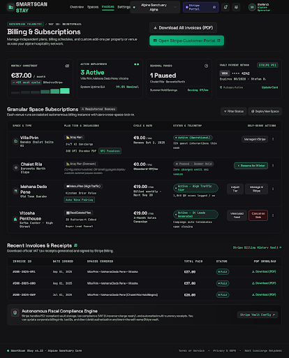
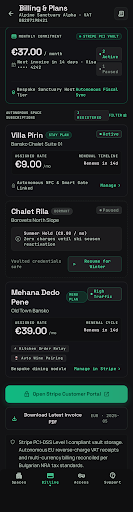

# Design Spec: 07_billing_subscriptions (Granular Per-Space Billing & Stripe Portal)

- **Platforms**: Desktop Web (1440px+) & Mobile Responsive (390px iOS/Android)
- **Aesthetic**: Obsidian High-Tech Luxury (Matching `design/00_design_system`)
- **Key Architecture**: Granular Per-Space Subscription Lifecycle (`space_id` independent billing instances)
- **Primary Integration**: Stripe Billing API + Stripe Customer Portal self-serve management

---

## Visual Previews

### 1. Desktop View (1440px)

### 2. Mobile Responsive View (390px)

---

## 1. Color Palette Tokens

| Token | HEX / Value | Role |
|---|---|---|
| `billing-bg` | `#09090B` | Deep space obsidian canvas background |
| `card-surface` | `#121216` | Frosted dark glass containers |
| `card-border` | `rgba(255, 255, 255, 0.08)` | Crisp 1px hairline border |
| `accent-emerald` | `#10B981` | Cyber Emerald (Active statuses, Portal CTAs, savings) |
| `status-paused` | `#EAB308` / `#71717A` | Dormant/Paused seasonal badges |
| `text-primary` | `#FFFFFF` | Headings, amounts, space titles |
| `text-secondary` | `#A1A1AA` | Subtitles, billing dates, descriptions |
| `text-muted` | `#71717A` | Tax IDs, receipts, invoice IDs |

---

## 2. Component Hierarchy & Flow

### A. Summary KPI Bar
- **Monthly Commitment**: Total active bill (e.g. `€37.00 / month`).
- **Active Deployments**: `3 Active` (Villa Pirin, Mehana Dedo Pene, Vitosha Penthouse).
- **Seasonal Pauses**: `1 Paused` (Chalet Rila · Borovets North · Summer Hold Savings: `Saving €9/mo`).
- **Vault Payment Method**: `VISA **** 4242` (Stripe PCI Level 1 secured).

### B. Granular Spaces Billing Table
Each venue runs an isolated autonomous billing instance with zero cross-space lock-in:
1. **Villa Pirin** · 🏡 `Stay Plan` · **€9.00 / mo** · `🟢 Active` · Action: `Manage in Stripe`.
2. **Chalet Rila** · 🏡 `Stay Plan (Dormant)` · **€0.00 / mo** · `⏸️ Paused - Summer Hold` (Zero charges until ski season reactivation) · Action: **`Resume for Winter`**.
3. **Mehana Dedo Pene** · 🍽️ `Menu Plan` · **€39.00 / mo** · `🟢 Active - High Traffic Tier` (1,840 QR scans logged / mo) · Action: `Manage in Stripe`.
4. **Vitosha Penthouse** · 🏢 `Real Estate Plan` · **€19.00 / mo** · `🟢 Active` (24 Leads Generated · Campaign auto-terminates upon closing) · Action: `Cancel on Sale`.

### C. Self-Service Actions
- **`Open Stripe Customer Portal`**: Direct 1-click redirect to Stripe-hosted self-serve panel for card updates, tax ID edits, and instant cancellations.
- **`Download All Invoices (PDF)`**: Automated EU reverse-charge VAT receipts and multi-currency billing invoices.
