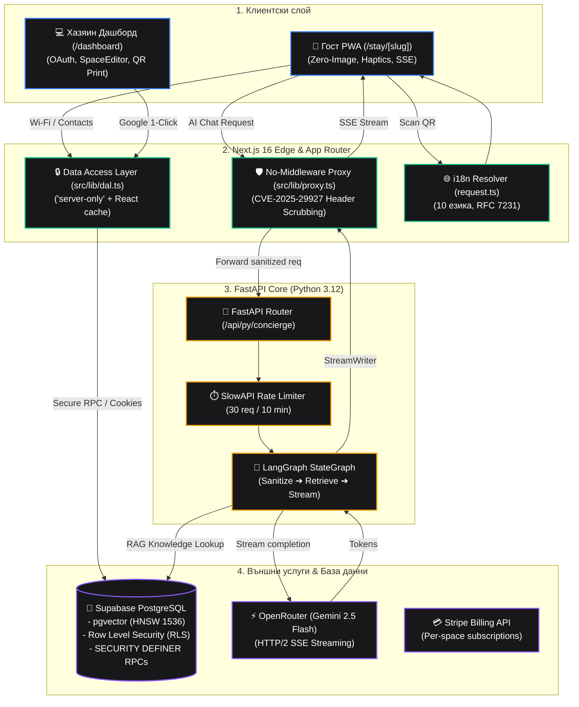

# SmartScan Stay — Документационен център

Добре дошли в официалния документационен център на **SmartScan Stay** — високоефективна, олекотена дигитална консиерж платформа за краткосрочни наеми (Airbnb, вили, къщи за гости).

---

## 1. Бърз индекс на документацията

### 🧭 Архитектура & Проектен план
- [**AGENTS.md**](file:///d:/myProjects/smart_scan/AGENTS.md) — Главна системна архитектурна спецификация, инженерни стандарти, мулти-тенант модел, правила за сигурност и забрани.
- [**ROADMAP.md**](file:///d:/myProjects/smart_scan/ROADMAP.md) — 10-стъпков чек-лист за поетапно изпълнение с верификационни критерии и текущ статус.
- [**README.md (Root)**](file:///d:/myProjects/smart_scan/README.md) — Главно ръководство за инсталация, стартиране, променливи на средата и системни зависимости.

---

### 📚 Поетапни отчети за реализацията (`docs/steps/`)

| Етап | Документ | Статус | Основни технологии и акценти |
| :--- | :--- | :--- | :--- |
| **Стъпка 1** | [**Step 01: Landing Page & i18n**](file:///d:/myProjects/smart_scan/docs/steps/step-01-landing-and-i18n.md) | 🟢 Завършена | Obsidian Luxury дизайн, 10 езика с `next-intl`, No-Middleware RFC 7231 резолюция, Bento мрежа. |
| **Стъпка 2** | [**Step 02: Host Authentication**](file:///d:/myProjects/smart_scan/docs/steps/step-02-host-authentication.md) | 🟢 Завършена | 1-Click Google OAuth, `@supabase/ssr` HttpOnly бисквитки, DAL сървърна защита на `/dashboard`. |
| **Стъпка 3** | [**Step 03: Guest PWA Experience**](file:///d:/myProjects/smart_scan/docs/steps/step-03-guest-pwa-experience.md) | 🟢 Завършена | Zero-Image PWA под 200ms, 1-Click Wi-Fi с `navigator.vibrate(50)`, 4-площна SOS решетка, Zero-Empty-States. |
| **Стъпка 4** | [**Step 04: Database & DAL**](file:///d:/myProjects/smart_scan/docs/steps/step-04-database-migrations-dal.md) | 🟢 Завършена | PostgreSQL + pgvector HNSW индекс, RLS политики, RPC функции, сървърен DAL (`server-only`). |
| **Стъпка 5** | [**Step 05: FastAPI AI Concierge**](file:///d:/myProjects/smart_scan/docs/steps/step-05-fastapi-ai-concierge-proxy.md) | 🟢 Завършена | FastAPI Python 3.12, LangGraph `StateGraph`, OpenRouter SSE стрийминг, Prompt Injection защита, `proxy.ts` (CVE-2025-29927). |
| **Стъпка 6** | *Step 06: Host Dashboard* | ⚪ Очаква | Пълен контролен панел на хазяина за редакция на данни, контакти и правила. |
| **Стъпка 7** | *Step 07: Voice Ingest & Whisper* | ⚪ Очаква | Гласово въвеждане на бележки (MediaRecorder + Whisper v3 + структуриране с Gemini). |
| **Стъпка 8** | *Step 08: Physical QR Plaques* | ⚪ Очаква | Векторни A5/A6 PDF табелки за печат с `@react-pdf/renderer` (300+ DPI). |
| **Стъпка 9** | *Step 09: Stripe Granular Billing* | ⚪ Очаква | Грануларно таксуване €9/месец на обект със сезонен паузинг и Stripe Customer Portal. |
| **Стъпка 10**| *Step 10: Production Hardening* | ⚪ Очаква | E2E тестове, пълен одит на сигурността, Core Web Vitals одит. |

---

### 🔐 Специализирани технически ръководства
- [**Автентикация & Сигурност**](file:///d:/myProjects/smart_scan/docs/authentication.md) — Подробен анализ на Google OAuth 2.0 потока, защитата от отворени пренасочвания (Open Redirect), управлението на бисквитки и разделението на отговорностите.

---

### 🎨 Дизайн спецификации (`design/`)
- [`design/00_master_tokens.md`](file:///d:/myProjects/smart_scan/design/00_master_tokens.md) — Дизайн токени (цветове, градиенти, сенки, радиуси, типография).
- [`design/01_guest_pwa_mobile.md`](file:///d:/myProjects/smart_scan/design/01_guest_pwa_mobile.md) — Мобилно PWA за гости (`/stay/[slug]`).
- [`design/02_qr_acrylic_plaque.md`](file:///d:/myProjects/smart_scan/design/02_qr_acrylic_plaque.md) — Физически акрилни табелки с QR код (A5/A6).
- [`design/03_host_dashboard.md`](file:///d:/myProjects/smart_scan/design/03_host_dashboard.md) — Административен панел за хазяи (`/dashboard`).
- [`design/04_voice_ingest_wizard.md`](file:///d:/myProjects/smart_scan/design/04_voice_ingest_wizard.md) — Гласов ингест и Whisper транскрипция.
- [`design/05_landing_page.md`](file:///d:/myProjects/smart_scan/design/05_landing_page.md) — Начална презентационна страница.
- [`design/06_auth_and_onboarding.md`](file:///d:/myProjects/smart_scan/design/06_auth_and_onboarding.md) — Автентикация и онбординг поток.
- [`design/07_stripe_billing_architecture.md`](file:///d:/myProjects/smart_scan/design/07_stripe_billing_architecture.md) — Грануларно таксуване на ниво обект.

---

## 2. Архитектурна диаграма на цялата система

