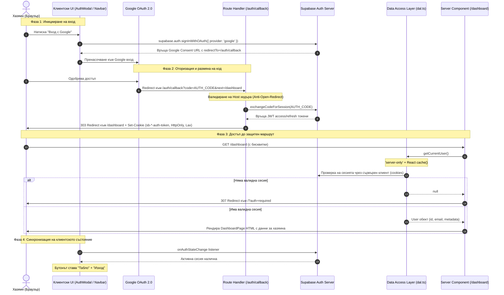

# Архитектура на Автентикацията в SmartScan Stay

> **Статус**: 🟢 Производствено внедрена и верифицирана  
> **Технологии**: Next.js 16 (App Router), @supabase/ssr, Supabase Auth (Google OAuth 2.0), TypeScript  
> **Архитектурна политика**: **No-Middleware** (защита срещу CVE-2025-29927), Data Access Layer (DAL), Defense in Depth  

---

## 1. Концептуален преглед

Автентикацията в **SmartScan Stay** е проектирана за хазяи и мениджъри на имоти с фокус върху:
1. **1-Click Google OAuth (Zero Passwords)**: Хазяите не създават и не помнят пароли. Входът е мигновен през надежден Google акаунт, като автоматично се извличат име, имейл и аватар.
2. **Защитени HTTP-Only Бисквитки (@supabase/ssr)**: Сесиите се съхраняват в криптографски защитени бисквитки от браузъра, недостъпни за клиентски JavaScript (пълна защита срещу XSS).
3. **No-Middleware архитектура**: За разлика от класическия Next.js подход с `middleware.ts`, проверката за права и пренасочването се извършват директно на сървърно ниво в **Data Access Layer (DAL)** и **Server Components**. Това елиминира рисковете от байпас на сигурността чрез манипулация на вътрешни хедъри (напр. уязвимостта **CVE-2025-29927**).
4. **Defense in Depth**: Защитата не разчита на една-единствена точка. Всяка сървърна страница, DAL заявка и Route Handler самостоятелно верифицират сесията.

---

## 2. Диаграма на потока (Authentication Flow)

Следващата диаграма описва пълния път — от клика на потребителя до зареждането на защитения контролен панел:



---

## 3. Детайлно описание на стъпките

### Стъпка 1: Иницииране на входа (Клиентски слой)
- Компонентите `AuthModal.tsx` и `NavbarAuthAction.tsx` използват браузърния клиент:
```typescript
import { createClient } from '@/lib/supabase/client';

const handleGoogleSignIn = async () => {
  const supabase = createClient();
  await supabase.auth.signInWithOAuth({
    provider: 'google',
    options: {
      redirectTo: `${window.location.origin}/auth/callback?next=/dashboard`,
    },
  });
};
```
- Браузърът пренасочва хазяина към официалния Google OAuth екран.

---

### Стъпка 2: Callback и размяна на код (Route Handler)
- Файл: `frontend/src/app/auth/callback/route.ts`
- След успешен вход в Google, потребителят се връща на адрес `/auth/callback?code=xyz&next=/dashboard`.
- **Защита от Open Redirect и Host Injection**:
  Route Handler-ът проверява доверения произход (`x-forwarded-host` спрямо позволен списък или конфигуриран canonical origin), за да предотврати пренасочване към злонамерени външни домейни.
- **Размяна на код за сесия**:
```typescript
const supabase = await createClient();
const { error } = await supabase.auth.exchangeCodeForSession(code);
if (!error) {
  return NextResponse.redirect(`${origin}${next}`);
}
```
- Библиотеката `@supabase/ssr` автоматично пакетира сесийните токени в HTTP-only бисквитки с флаг `SameSite=Lax`.

---

### Стъпка 3: Data Access Layer (DAL) и No-Middleware защита
- Файл: `frontend/src/lib/auth/dal.ts`
- Съгласно нашия стандарт за сигурност, **не съществува `middleware.ts`**. Вместо това, оторизацията се контролира на сървъра чрез изолиран Data Access Layer.
- Защо DAL е проектиран така:
  1. **Директива `'server-only'`**: Гарантира по време на компилация, че файлът никога няма да бъде включен в клиентския JavaScript бъндъл.
  2. **Мемоизация чрез `React.cache()`**: Ако в една заявка десет различни компонента поискат `getCurrentUser()`, функцията ще се изпълни точно **веднъж**.
```typescript
import 'server-only';
import { cache } from 'react';
import { createClient } from '@/lib/supabase/server';

export const getCurrentUser = cache(async () => {
  try {
    const supabase = await createClient();
    const {
      data: { user },
      error,
    } = await supabase.auth.getUser();

    if (error || !user) {
      return null;
    }

    return user;
  } catch {
    return null;
  }
});
```

---

### Стъпка 4: Защита на страницата (Server Component)
- Файл: `frontend/src/app/dashboard/page.tsx`
- Страницата е асинхронен Server Component. Преди да започне рендирането на каквото и да е съдържание, тя проверява сесията:
```typescript
const Page = async () => {
  // Сървърна проверка на сесията
  const user = await getCurrentUser();

  if (!user) {
    redirect('/?auth=required');
  }

  return <DashboardPage user={user} />;
};
```
- Ако хазяинът не е логнат, сървърът незабавно връща **HTTP 307 Temporary Redirect**. Браузърът никога не получава HTML кода или данните на таблото.

---

### Стъпка 5: Динамичен UI и Синхронизация в реално време
- Файл: `frontend/src/features/landing/components/NavbarAuthAction.tsx`
- В клиентските компоненти се регистрира слушател за събития:
```typescript
useEffect(() => {
  const supabase = createClient();
  supabase.auth.getUser().then(({ data: { user } }) => setCurrentUser(user));

  const { data: { subscription } } = supabase.auth.onAuthStateChange((_event, session) => {
    setCurrentUser(session?.user ?? null);
  });

  return () => subscription.unsubscribe();
}, []);
```
- **Състояние "Нелогнат"**: Показва бутон `Вход с Google`, отварящ модала.
- **Състояние "Логнат"**: Показва бутони `Табло` (`/dashboard`) и `Изход` (`Sign Out`).

---

### Стъпка 6: Изход от профила (Sign Out)
- При клик върху `Изход`, клиентът изпълнява:
```typescript
const handleSignOut = async () => {
  const supabase = createClient();
  await supabase.auth.signOut();
  router.push('/');
  router.refresh();
};
```
- `supabase.auth.signOut()` информира Supabase сървъра и заличава бисквитките в браузъра.
- `router.refresh()` изчиства сървърния клиентски кеш на Next.js, гарантирайки мигновено отразяване на промяната.

---

## 4. Списък на ключовите файлове и техните отговорности

| Файл | Слой | Отговорност |
| :--- | :--- | :--- |
| `frontend/src/lib/supabase/client.ts` | Браузър | Инициализира клиентския Supabase инстанс (`createBrowserClient`) за OAuth и `onAuthStateChange`. |
| `frontend/src/lib/supabase/server.ts` | Сървър | Създава сървърен Supabase клиент (`createServerClient`) с асинхронен достъп до бисквитките чрез `cookies()` на Next.js 16. Използва именувана функция (`export async function createClient()`). |
| `frontend/src/lib/auth/dal.ts` | Сървър (DAL) | `server-only` Data Access Layer с `cache()` за извличане на автентикирания потребител. |
| `frontend/src/app/auth/callback/route.ts` | Route Handler | Приема OAuth кода от Google, разменя го за сесийна бисквитка и пренасочва. Защитен от Open Redirect. |
| `frontend/src/app/dashboard/page.tsx` | Server Route | Защитен маршрут за `/dashboard`. Връща HTTP 307 към началната страница при липса на сесия. |
| `frontend/src/features/landing/components/NavbarAuthAction.tsx` | Client Component | Динамичен бутон в навигацията (Вход с Google ➔ Табло / Изход). |
| `frontend/src/features/dashboard/DashboardPage.tsx` | Client Component | Контролен панел на хазяина с вила карта, метрики и навигационна лента. |
| `frontend/src/features/dashboard/components/PropertyCard.tsx` | Client Component | Динамична карта с преведени статуси (Active, Paused, Draft) през `useTranslations('dashboard')`. |

---

## 5. Сигурност и Инженерни Стандарти

### Защо No-Middleware политика?
Традиционният подход с `middleware.ts` в Next.js страда от следните недостатъци:
1. **Уязвимости при вътрешни хедъри (напр. CVE-2025-29927)**: Подправяне на хедъра `x-middleware-subrequest` може да заобиколи защитата в определени среди.
2. **Липса на пълноценен Node.js runtime**: Middleware работи в орязан Edge runtime, където редица Node.js библиотеки и сигурни криптографски модули не са налични.
3. **Решението на SmartScan Stay**: Пренасяне на защитата в **Data Access Layer** и **Server Components**. Така кодът се изпълнява в пълноценен сървърен контекст с директива `'server-only'`.

### Конвенция за функции
- **React компоненти**: Използват стриктно стрелкови функции (`const Component: React.FC<Props> = () => { ... }`).
- **Сървърни функции, хелпъри и DAL**: Използват стандартна декларация на функции (`export async function createClient()`, `export function createClient()`).

### Пълна i18n поддръжка
Всички статуси на имотите (`active`, `paused`, `draft`), бутони за вход/изход, подсказки и съобщения в автентикационния процес са преведени на всички **10 поддържани езика** в `frontend/messages/*.json`. Няма никакви хардкорнати низове.

---

## 6. Верификация на функционалността

За да се уверите в коректната работа на автентикацията:

1. **Тест за блокиране на неавтентикиран достъп**:
```bash
curl.exe -I "http://localhost:3000/dashboard"
```
*Очакван отговор*: `HTTP/1.1 307 Temporary Redirect` с хедър `Location: /?auth=required`.

2. **Проверка на типовете**:
```bash
npx tsc --project frontend/tsconfig.json --noEmit
```
*Очакван изход*: 0 грешки.

3. **Проверка на линтера**:
```bash
npm --prefix frontend run lint
```
*Очакван изход*: 0 грешки, 0 предупреждения.

4. **Проверка на производствения билд**:
```bash
npm --prefix frontend run build
```
*Очакван изход*: Успешно компилирани маршрути `ƒ /auth/callback` и `ƒ /dashboard`.
