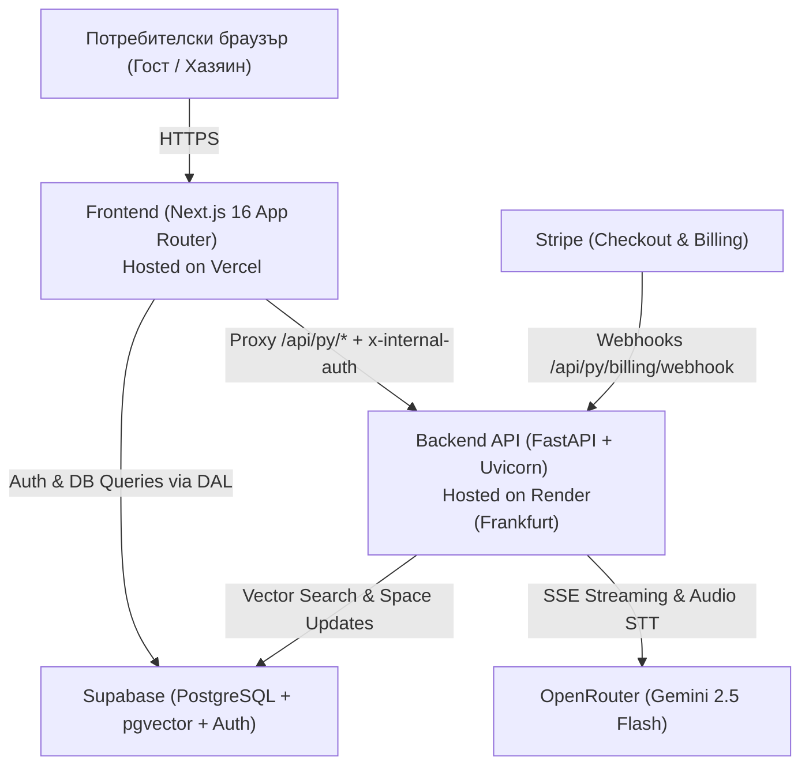

# SmartScan Stay — Production Deployment Guide

Този документ описва архитектурата, платформите и пълния процес по деплой на **SmartScan Stay** (Frontend + Backend + Database + Payments + AI) в реална среда.

---

## 1. Обща архитектура на разгръщане (Overview)

Системата е структурирана като монорепо с ясно разделение на отговорностите:



| Компонент | Технология | Платформа | Локация | План |
| :--- | :--- | :--- | :--- | :--- |
| **Frontend** | Next.js 16, React 19, Tailwind v4 | **Vercel** | Global Edge (Anycast) | Hobby (Free) |
| **Backend** | FastAPI, Python 3.11+, Uvicorn ASGI | **Render.com** | Frankfurt, Germany (EU Central) | Web Service (Free) |
| **Database & Auth** | PostgreSQL, pgvector (HNSW), Supabase Auth | **Supabase** | Frankfurt, Germany (EU Central) | Free Tier |
| **AI LLM & STT** | Gemini 2.5 Flash (Multimodal Audio & Chat) | **OpenRouter** | Cloud API | Pay-as-you-go |
| **Плащания** | Stripe Checkout & Customer Portal | **Stripe** | Global API | Standard |

---

## 2. Бекенд деплой (FastAPI в Render.com)

Бекендът работи като самостоятелен Uvicorn ASGI сървър в Render с пълна поддръжка за HTTP Server-Sent Events (SSE) стрийминг и 25MB аудио ъплоуди.

### 2.1. Конфигурация на услугата
* **Service Type**: `Web Service`
* **Region**: `Frankfurt (EU Central)` *(за минимална латентност до България)*
* **Root Directory**: `backend` *(задължително заради монорепо структурата)*
* **Environment / Runtime**: `Python 3`
* **Build Command**: `pip install -r requirements.txt`
* **Start Command**: `uvicorn app.main:app --host 0.0.0.0 --port $PORT`
* **Health Check Path**: `/api/py/health`
* **Instance Type**: `Free` (512 MB RAM, 0.1 CPU)

### 2.2. Необходими Environment Variables в Render

| Променлива | Описание | Примерна стойност |
| :--- | :--- | :--- |
| `ENVIRONMENT` | Работна среда (`production` или `development`) | `production` |
| `PYTHON_VERSION` | Точна версия на Python | `3.11.9` |
| `ALLOWED_ORIGINS` | Позволени CORS домейни | `https://<your-vercel-domain>.vercel.app` |
| `FRONTEND_URL` | Базов URL за Stripe пренасочвания | `https://<your-vercel-domain>.vercel.app` |
| `BACKEND_PROXY_SECRET` | Споделен таен ключ за сигурност с Next.js проксито | `<Случайно генериран 64-символен hex ключ>` |
| `SUPABASE_URL` | URL на Supabase инстанцията | `https://<project-ref>.supabase.co` |
| `SUPABASE_PUBLISHABLE_KEY` | Публичен anon ключ на Supabase | `sb_publishable_...` |
| `SUPABASE_SECRET_KEY` | Сервизен (service_role) таен ключ на Supabase | `sb_secret_...` |
| `SUPABASE_JWKS_URL` | URL за верификация на JWT токени | `https://<project-ref>.supabase.co/auth/v1/.well-known/jwks.json` |
| `OPENROUTER_API_KEY` | API ключ от OpenRouter | `sk-or-v1-...` |
| `OPENROUTER_MODEL` | Модел за консиерж стрийминг | `google/gemini-2.5-flash` |
| `STRIPE_SECRET_KEY` | Таен ключ на Stripe | `sk_test_...` или `sk_live_...` |
| `STRIPE_PRICE_ID_STAY` | Ценови идентификатор на абонамента в Stripe | `price_...` |
| `STRIPE_WEBHOOK_SECRET` | Signing secret за верификация на Stripe Webhooks | `whsec_...` |

> [!TIP]
> **Справяне със Spin-down (Sleep mode) на Render Free Tier:**
> Безплатните Web Services в Render заспиват при 15 минути липса на заявки. За да поддържате инстанцията топла 24/7 безплатно, конфигурирайте безплатен външен мониторинг през [UptimeRobot](https://uptimerobot.com) или [cron-job.org](https://cron-job.org) с HTTP GET пинг на всеки 10-12 минути към: `https://<your-render-url>.onrender.com/api/py/health`.

---

## 3. Фронтенд деплой (Next.js 16 във Vercel)

Фронтендът управлява потребителския интерфейс, PWA страниците на обектите, хост дашборда и сигурното проксиране към бекенда.

### 3.1. Конфигурация на проекта във Vercel
* **Framework Preset**: `Next.js`
* **Root Directory**: `frontend` *(натиска се Edit и се избира само поддиректорията `frontend`)*
* **Build Command**: `npm run build` (по подразбиране)
* **Output Directory**: Next.js default (`.next`)

### 3.2. Архитектура на проксито (`proxy.ts` и `route.ts`)
Всички клиентски заявки от браузъра към `/api/py/*` преминават през Serverless Route Handler (`frontend/src/app/api/py/[...path]/route.ts`), който:
1. Защитава от CVE-2025-29927 (Header Scrubbing – премахва потенциално фалшифицирани външни `x-*` заглавия).
2. Извлича реалния IP адрес на клиента от `x-vercel-forwarded-for`.
3. Инжектира тайния `x-internal-auth: BACKEND_PROXY_SECRET` хедър.
4. Препраща заявката към `BACKEND_INTERNAL_URL` с `maxDuration = 60` за осигуряване на непрекъснат SSE стрийминг.

### 3.3. Необходими Environment Variables във Vercel

| Key | Тип във Vercel | Описание |
| :--- | :--- | :--- |
| `NEXT_PUBLIC_SITE_URL` | **Config** | Каноничен публичен домейн (напр. `https://smart-scan-mu.vercel.app`) |
| `BACKEND_INTERNAL_URL` | **Secret** | URL на активния Render бекенд (без наклонена черта накрая) |
| `BACKEND_PROXY_SECRET` | **Secret** | Споделен ключ (трябва точно да съвпада с този в Render) |
| `NEXT_PUBLIC_SUPABASE_URL` | **Config** | Публичен адрес на Supabase |
| `NEXT_PUBLIC_SUPABASE_PUBLISHABLE_KEY` | **Config** | Публичен ключ на Supabase |
| `SUPABASE_URL` | **Secret** | Сървърен Supabase URL |
| `SUPABASE_PUBLISHABLE_KEY` | **Secret** | Сървърен Supabase publishable key |
| `SUPABASE_SECRET_KEY` | **Secret** | Таен ключ за Data Access Layer (DAL) заявки |
| `SUPABASE_JWKS_URL` | **Secret** | JWKS емитер за JWT верификация |
| `NEXT_PUBLIC_STRIPE_PUBLISHABLE_KEY` | **Config** | Публичен ключ за Stripe Elements / Checkout (`pk_test_...`) |
| `NEXT_PUBLIC_STRIPE_PRICE_ID_STAY` | **Config** | Ценови ID на плана в Stripe (`price_...`) |

---

## 4. Конфигурация на Supabase (Authentication & Redirects)

За да работи Google OAuth автентикацията без пренасочване към `localhost`, в Supabase Dashboard се конфигурират позволените пренасочвания.

### Стъпки:
1. Влезте в **[Supabase Dashboard](https://supabase.com/dashboard)** ➔ изберете проекта.
2. Отворете **Authentication** ➔ **URL Configuration**.
3. Задайте:
   * **Site URL**:
     ```text
     https://<your-vercel-domain>.vercel.app
     ```
   * **Redirect URLs** (в списъка се добавят):
     * `https://<your-vercel-domain>.vercel.app/**`
     * `http://localhost:3000/**` *(запазва се за локална разработка)*
4. Натиснете **Save**.

---

## 5. Stripe Webhooks интеграция

Stripe управлява абонаментите на ниво конкретен обект (`space_id`). Връзката между Stripe и Supabase се осъществява чрез асинхронни Webhooks.

### 5.1. Конфигуриране на Endpoint в Stripe
1. В **[Stripe Dashboard](https://dashboard.stripe.com)** влезте в **Developers** ➔ **Webhooks** (или **Workbench** ➔ **Event Destinations**).
2. Натиснете **Add an endpoint** / **Create destination**:
   * **Endpoint URL**:
     ```text
     https://<your-render-domain>.onrender.com/api/py/billing/webhook
     ```
   * **Destination type**: `Webhook endpoint`
   * **Events to send** (3 задължителни събития):
     * `checkout.session.completed`
     * `customer.subscription.updated`
     * `customer.subscription.deleted`
3. След запазване разкрийте **Signing secret** (`whsec_...`).
4. Поставете тази стойност в Render като `STRIPE_WEBHOOK_SECRET`.

### 5.2. Жизнен цикъл на абонамента в базата данни:
* **Създаване на обект**: Автоматично се задава `subscription_status = 'trialing'` с `trial_ends_at = NOW() + 14 days`.
* **Успешно плащане (`checkout.session.completed`)**: Webhook-ът записва `subscription_status = 'active'`, `stripe_subscription_id = sub_... (?? ???? public.hosts)`, `stripe_customer_id = cus_...` и нулира `trial_ends_at = NULL`.
* **Прекратяване (`customer.subscription.deleted`)**: Webhook-ът променя статуса на `canceled` и заключва функциите за госта.
* **Изтриване на обект от хазяина**: Бекенд услугата извлича записания `stripe_subscription_id` и автоматично прекратява абонамента в Stripe преди изтриване на записа.

---

## 6. Чеклист за верификация след деплой

- [ ] **Backend Health Check**: Заявка към `https://<render-url>/api/py/health` връща HTTP 200 с JSON статус `healthy`.
- [ ] **Frontend Proxy Health Check**: Заявка към `https://<vercel-url>/api/py/health` успешно се проксира и връща HTTP 200 от бекенда.
- [ ] **Google OAuth Login**: Входът от началната страница пренасочва успешно към `/dashboard` без `ERR_CONNECTION_REFUSED`.
- [ ] **Stripe Checkout**: Бутонът за абонамент отваря Stripe Checkout и след плащане пренасочва обратно към обекта.
- [ ] **Webhook Delivery**: В Stripe Webhook логовете изпратеното събитие връща статус `200 OK`, а в Supabase статусът се сменя на `active`.
- [ ] **Guest PWA & AI Concierge**: Отваряне на `/stay/[slug]` зарежда виртуалния наръчник и чатът стриймва отговори без прекъсване.
