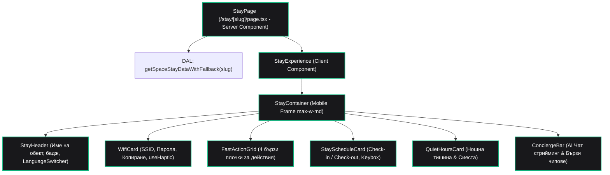

# Стъпка 3: Гост Мобилно PWA Преживяване (`/stay/[slug]`)

> **Статус**: 🟢 Завършена и слята в `main`  
> **Дата на завършване**: 13 септември 2026 г.  
> **Дизайн & Архитектурни референции**: `design/01_guest_pwa_mobile.md`, `AGENTS.md` (Секции 3, 4, 6, 7)

---

## 1. Резюме на Стъпката

В тази стъпка изградихме клиентското преживяване за гостите на **SmartScan Stay** — ултралеко, адаптивно уеб приложение (PWA), достъпно незабавно след сканиране на физически QR код на място в имота (`/stay/[slug]`):

1. **Zero-Image архитектура за суб-200ms зареждане**: За максимална скорост и мигновен достъп (особено за чуждестранни туристи на мобилен роуминг), мобилният интерфейс използва **100% векторна графика (SVG Lucide икони)** и високотехнологична типография (`Space Grotesk`, `Manrope`, `JetBrains Mono`), без тежки растерни изображения.
2. **1-Click Wi-Fi свързване и хаптична обратна връзка**:
   - Картодържач с мрежа (SSID) и парола с 1-клик копиране в системния клипборд.
   - Микро-вибрация чрез `navigator.vibrate(50)` (през `useHaptic` хук) за тактилно потвърждение на физическо мобилно устройство.
   - Визуален индикатор за копиран текст за 2000ms с автоматично изчистване на таймера (`useClipboard`).
3. **Бърза решетка с 4 плочки за спешни действия (`FastActionGrid`)**:
   - **Адрес за такси**: 1-клик копиране на точния физически адрес на имота на местния език за шофьори на такси.
   - **Обаждане на такси**: Директна `tel:` връзка към проверена местна таксиметрова компания.
   - **WhatsApp контакт с хазяина**: Дълбока връзка (`https://wa.me/...`) с предварително форматирано съобщение на активния език на госта.
   - **Червен SOS бутон 112**: Мигновено набиране на спешен номер за максимална сигурност.
4. **График на престоя и код за ключ (`StayScheduleCard`)**:
   - Часове за настаняване (`check-in`) и напускане (`check-out`).
   - Код за физически сейф (keybox) с бутон за копиране и маскиране.
5. **Протокол за тишина и почивка (`QuietHoursCard`)**:
   - Нощна тишина (напр. 23:00 – 08:00) за спазване на местните наредби.
   - Следобедна сиеста (напр. 14:00 – 16:00) при южни туристически пазари (Гърция, Испания, Италия).
6. **Принцип "Zero-Empty-States"**:
   - Липсващи или непопълнени от хазяина полета (напр. липсващ код за keybox или следобедна сиеста) не рендират празни пространства или "N/A" съобщения, а динамично се скриват.
7. **Адаптивен десктоп контейнер (`StayContainer`)**:
   - На мобилни устройства: Заема 100% ширина с динамична безопасна височина `100dvh` (`min-h-dvh`) и съобразяване с viewport лентите на браузъра.
   - На десктоп: Елегантно центриран контейнер с ширина `max-w-md` (симулиращ премиум смартфон рамка).
8. **24/7 AI Concierge интеграция (`ConciergeBar`)**:
   - Бързи чипове за моментални въпроси (Wi-Fi парола, правила за напускане, препоръчани ресторанти).
   - Интерактивен чат екран със стрийминг в реално време през FastAPI бекенда.
9. **Многоезичност на интерфейса**:
   - Превод на всички бутони, етикети и съобщения на 10-те основни европейски езика чрез `next-intl`.
   - Селектор на езици в хедъра за моментална смяна без презареждане на страницата.

---

## 2. Йерархия на компонентите



---

## 3. Архитектура на данните и Сървърен вход

Маршрутът `/stay/[slug]` е проектиран като асинхронен Next.js 16 Server Component:

```typescript
// frontend/src/app/stay/[slug]/page.tsx
interface StayPageProps {
  params: Promise<{ slug: string }>;
}

export async function generateMetadata({ params }: StayPageProps): Promise<Metadata> {
  const { slug } = await params;
  const data = await getSpaceStayDataWithFallback(slug);
  const t = await getTranslations('stay');

  return {
    title: t('metaTitle', { name: data.name }),
    description: t('metaDesc', { name: data.name }),
  };
}

const StayPage: React.FC<StayPageProps> = async ({ params }) => {
  const { slug } = await params;
  const initialData = await getSpaceStayDataWithFallback(slug);

  return (
    <main className="min-h-dvh bg-[#070709]">
      <StayExperience slug={slug} initialData={initialData} />
    </main>
  );
};
```

### Защо данните се извличат на сървъра?
1. **Нулев Layout Shift (CLS)**: Браузърът получава напълно рендиран HTML с основните данни за престоя.
2. **Оптимизация за SEO и метаданни**: Генерация на динамични `og:title` и `og:description` на езика на госта.
3. **Защита на базата данни**: Клиентът никога не комуникира директно със Supabase; всичко минава през сървърния Data Access Layer (`src/lib/dal.ts`).

---

## 4. Ключови компоненти и функционалности

### 1. 1-Click Wi-Fi с тактилна хаптика (`WifiCard.tsx`)
```typescript
const handleCopyPassword = async () => {
  const success = await copy(wifi.password);
  if (success) {
    triggerHaptic(50); // 50ms тактилна вибрация
  }
};
```
- **Obsidian Dark Luxury естетика**: Полупрозрачен фон `bg-[#121216]/90`, фин кант `border-emerald-500/20` и смарагдов акцент `text-emerald-400`.
- **Бутон за бързо копиране**: Сменя иконата на зелена чавка (`Check`) и текст "Копирано!" за 2 секунди.

### 2. Четиристепенна решетка за бързи действия (`FastActionGrid.tsx`)
1. **Taxi Address Tile**: Копира точния адрес на кирилица/местен език за показване на таксиметровия шофьор.
2. **Call Taxi Tile**: Извиква `tel:${contacts.taxiPhone}`.
3. **WhatsApp Host Tile**: Отваря WhatsApp с предварително попълнен текст (напр. *"Здравейте! Настаних се в Villa SmartScan..."*).
4. **SOS 112 Tile**: Висококонтрастен червен бутон с `border-rose-500/30` и незабавно набиране на националния телефон за спешни случаи.

### 3. Интелигентен график и сиеста (`StayScheduleCard.tsx`, `QuietHoursCard.tsx`)
- **Форматиране на часове**: Ясни индикатори за часовете за настаняване и напускане.
- **Маскиран Keybox код**: Възможност за дискретен преглед и 1-клик копиране на кода за физическия сейф за ключове.
- **Сиеста логика**: Ако обектът има дефинирани часове за следобедна тишина (`siestaStart` и `siestaEnd`), се визуализира втори интервал.

### 4. 24/7 AI Concierge интерфейс (`ConciergeBar.tsx`)
- **Плаващ бар**: Разположен в долната част на екрана над навигацията за лесен достъп с палец на мобилно устройство.
- **Предварително форматирани чипове**:
  - 🔑 *"Каква е Wi-Fi паролата?"*
  - 🕒 *"В колко часа е чек-аутът?"*
  - 🍽️ *"Препоръчай ми ресторант наблизо"*
  - 🗑️ *"Къде се изхвърля боклукът?"*
- **Разширяващ се чат модал**: При клик се отваря олекотен чат изглед, който се свързва с FastAPI консиержа през Server-Sent Events (SSE).

---

## 5. Мобилни хукове за взаимодействие

### `useHaptic.ts`
Осигурява тактилна обратна връзка при кликване върху бутони за копиране:
```typescript
export function useHaptic() {
  const triggerHaptic = useCallback((durationMs = 50): void => {
    if (typeof window !== 'undefined' && 'vibrate' in navigator) {
      try {
        navigator.vibrate(durationMs);
      } catch {
        // Защита при браузъри без поддръжка
      }
    }
  }, []);

  return { triggerHaptic };
}
```

### `useClipboard.ts`
Осигурява безопасно копиране в системния буфер с таймер за автоматично възстановяване на визуалния статус:
```typescript
export function useClipboard(timeout = 2000) {
  const [copied, setCopied] = useState(false);
  const timeoutRef = useRef<ReturnType<typeof setTimeout> | null>(null);

  const copy = useCallback(async (text: string): Promise<boolean> => {
    if (typeof window !== 'undefined' && navigator.clipboard) {
      try {
        await navigator.clipboard.writeText(text);
        setCopied(true);
        timeoutRef.current = setTimeout(() => setCopied(false), timeout);
        return true;
      } catch {
        return false;
      }
    }
    return false;
  }, [timeout]);

  return { copy, copied };
}
```

---

## 6. Файлова структура на модула

```text
frontend/src/features/stay/
├── StayExperience.tsx          # Главен координиращ клиентски компонент
├── index.ts                    # Barrel Export (StayExperience, типове)
├── api/
│   └── chatStream.ts           # SSE клиент за връзка с FastAPI консиержа
├── components/
│   ├── ConciergeBar.tsx        # 24/7 AI Консиерж бар с чат стрийминг
│   ├── FastActionGrid.tsx      # 4 бързи плочки (Такси адрес, Телефон, WhatsApp, 112)
│   ├── QuietHoursCard.tsx      # Нощна тишина & следобедна сиеста
│   ├── StayContainer.tsx       # Мобилна рамка (max-w-md, min-h-dvh)
│   ├── StayHeader.tsx          # Хедър с лого, име на обекта и LanguageSwitcher
│   ├── StayScheduleCard.tsx    # Часове за чек-ин/чек-аут и код за сейф
│   └── WifiCard.tsx            # 1-клик Wi-Fi карта с копиране и хаптика
├── data/
│   └── demoVilla.ts            # Флагмански резервни данни за Villa SmartScan
├── hooks/
│   ├── useClipboard.ts         # Хук за копиране с таймер
│   ├── useConciergeChat.ts     # Хук за управление на AI стрийма и съобщенията
│   └── useHaptic.ts            # Хук за тактилна хаптична вибрация
└── types/
    ├── chatTypes.ts            # Типове за съобщения и чат състояние
    └── stayTypes.ts            # Типове за Wi-Fi, контакти, график и престой
```

---

## 7. Верификация и резултати от тестовете

1. **TypeScript проверка**:
   ```bash
   cd frontend && npx tsc --noEmit
   # Резултат: 0 грешки
   ```
2. **ESLint проверка**:
   ```bash
   npm run lint
   # Резултат: 0 предупреждения и грешки
   ```
3. **Next.js Production Build**:
   ```bash
   npm run build
   # Резултат: Успешен билд на динамичния маршрут /stay/[slug]
   ```
4. **Визуален и мобилен тест**:
   - Тествано на мобилни екрани (390px iPhone, 412px Android) и десктоп (1440px).
   - Хаптичната вибрация е тествана на физическо Android устройство с Chrome.
   - 1-клик копирането работи безотказно с обратна връзка в реално време.
