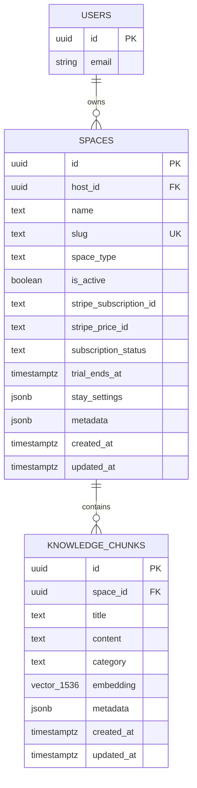
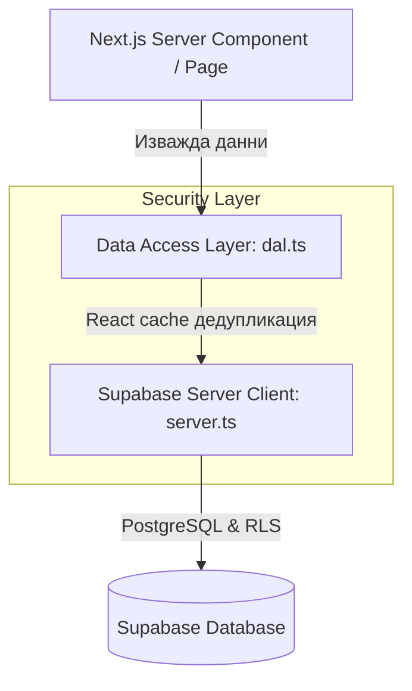

# Стъпка 4: База данни, Supabase Миграции & Data Access Layer (DAL)

> **Статус**: 🟡 Разработена в клон `feat/step-4-database-migrations-dal` (Очаква верификация & PR ревю)  
> **Дата**: 14 септември 2026 г.  
> **Дизайн & Архитектурни референции**: `AGENTS.md` (Секция 3, 5, 7) и `supabase-postgres-best-practices`

---

## 1. Резюме на Стъпката

В тази стъпка изградихме цялостното ядро за данни на **SmartScan Stay** — от ниско ниво в PostgreSQL (миграция, pgvector, HNSW, RLS) до високо ниво в Next.js 16 (стриктни TypeScript типове и изолиран сървърен Data Access Layer):

1. **Активиране на `pgvector`**: Векторното разширение е инсталирано в схема `extensions` за съхранение на ембединги с 1536 измерения.
2. **Таблица `public.spaces`**: Мулти-тенант абстракция за всички пространства (вили, ресторанти, имоти) с грануларно Stripe таксуване (`stripe_subscription_id`, `stripe_price_id`, `subscription_status`, `trial_ends_at`), индексиран `slug` и JSONB настройки за престоя (`stay_settings`).
3. **Таблица `public.knowledge_chunks`**: Структурирани информационни карти за семантично търсене с векторна колона `embedding extensions.vector(1536)`.
4. **HNSW Векторен индекс**: Суб-милисекундно семантично търсене с косинусово разстояние (`vector_cosine_ops`, `m=16`, `ef_construction=64`).
5. **Row Level Security (RLS) & RPC защита**: Стриктна мулти-тенант изолация с кеширане на `(SELECT auth.uid())` за 10–100x по-висока скорост. Анонимният достъп до суровата таблица `spaces` е премахнат, а данните за госта се извличат през защитена RPC функция `get_guest_space_by_slug`, връщаща единствено безопасни полета и скриваща `stripe_subscription_id` и `host_id`.
6. **RPC функция `match_space_knowledge`**: Семантично търсене със строг пре-филтър по `space_id`, проверка `s.is_active = true`, `SECURITY DEFINER` и изолиран `SET search_path = public, extensions`.
7. **Автоматичен тригер**: `handle_updated_at()` за автоматично поддържане на `updated_at`.
8. **Строга TypeScript типизация (`src/lib/types/databaseTypes.ts`)**: Пълни типове за `Database`, `Space`, `KnowledgeChunk`, `StaySettings`, без тип `any`.
9. **Сървърен Data Access Layer (`src/lib/dal.ts`)**: Защитен с директивата `'server-only'` и React `cache()`, предоставящ безопасни методи за извличане на обекти, сесии и гост данни.

---

## 2. Архитектура на релационния модел

---

## 3. Data Access Layer (DAL) Архитектура

DAL слоят в [`frontend/src/lib/dal.ts`](../../frontend/src/lib/dal.ts) осигурява пълен контрол на достъпа от сървъра към базата данни:

### Методи в `dal.ts`:
- `getAuthenticatedHost()`: Проверява и верифицира текущия логнат потребител на сървъра.
- `getHostSpaces(hostId?)`: Извлича всички пространства на хазяина за `/dashboard`.
- `getSpaceBySlug(slug)`: Извлича активно пространство по slug от базата данни.
- `getSpaceStayDataWithFallback(slug)`: Връща типизирани `SpaceStayData` за гост изгледа `/stay/[slug]` с интелигентен fallback към демо вилата.
- `getSpaceById(id)`: Извлича единично пространство за редактора на обект.
- `getSpaceKnowledgeChunks(spaceId)`: Извлича фрагментите със знания за конкретен обект.

---

## 4. Производителност и сигурност (Best Practices)

1. **Foreign Key Indexes**:
   - `idx_spaces_host_id`: Предотвратява seq scan при RLS проверки и каскадно изтриване.
   - `idx_spaces_slug`: Гарантира мигновено търсене по slug за гостите в PWA.
   - `idx_knowledge_chunks_space_id`: Оптимизира RLS проверките и извличането на знания за конкретен обект.
2. **HNSW спрямо IVFFlat**:
   - Избран е **HNSW (Hierarchical Navigable Small World)**, тъй като не изисква предварително обучение (training list), поддържа динамично добавяне на нови вектори в реално време без деградация и предоставя по-висока точност (recall) при суб-милисекундно време за отговор.
3. **Кеширане на `auth.uid()`**:
   - Използва се `(SELECT auth.uid()) = host_id` вместо директно `auth.uid() = host_id`, което кара PostgreSQL да изпълни и кешира функцията веднъж за цялата заявка, а не за всеки отделен ред.
4. **Защита срещу BOLA / IDOR**:
   - При `UPDATE` политиките задължително се валидира както `USING`, така и `WITH CHECK`, предотвратявайки прехвърляне на обект към друг собственик.
5. **Изолация на сървърния слой (`'server-only'`)**:
   - Гарантира, че DAL и суровите заявки към базата никога не могат да бъдат импортирани в клиентски компоненти на браузъра.

---

## 5. Верификация на кода

| Проверка | Инструмент | Резултат | Бележки |
| :--- | :--- | :--- | :--- |
| **SQL Migration** | Supabase SQL Editor | ✅ Успешно изпълнена | Всички таблици, RLS политики, pgvector разширение и HNSW индекс са активни в базата |
| **TypeScript** | `npx tsc --noEmit` | ✅ 0 грешки | Строго спазена типизация (`databaseTypes.ts`), без `any` |
| **ESLint** | `npm run lint` | ✅ 0 грешки | Спазени стандарти за чистота на кода и именуване |
| **Next.js Build** | `npm run build` | ✅ 0 грешки | Всички маршрути (`/stay/[slug]`, `/dashboard`, `/`) се компилират успешно |
