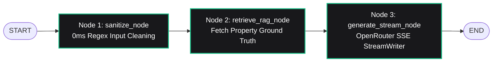

# Стъпка 5: FastAPI AI Concierge (LangGraph StateGraph) & Прокси слой

> **Статус**: 🟢 Завършена и слята в `main` (Merge commit `c6d81c8` от Pull Request #5)  
> **Дата**: 14 септември 2026 г.  
> **Дизайн & Архитектурни референции**: `AGENTS.md` (Секции 1, 4, 5, 6, 7), умение `fastapi-backend`, умение `nextjs-frontend`

---

## 1. Резюме на Стъпката

В тази стъпка изградихме интелигентния AI двигател на **SmartScan Stay** — високоефективен, олекотен, полиглотен дигитален консиерж с нулева латентност и стриктен контрол на API разходите:

1. **FastAPI ядро (`backend/app/`)**: Чиста 3-слойна архитектура (`Router ➔ Service ➔ Repository/DB`) с Python 3.12, стриктна типизация с Pydantic v2 и SlowAPI rate limiting (30 заявки / 10 минути на клиентски IP).
2. **LangGraph `StateGraph` AI пайплайн**: Модулен 3-възлов граф (`sanitize_node` ➔ `retrieve_rag_node` ➔ `generate_stream_node`), използващ `StreamWriter` за токен-по-токен предаване в режим `stream_mode="custom"`, `version="v2"`.
3. **OpenRouter & Gemini 2.5 Flash интеграция**: Директен стрийминг през HTTP/2 с модел `google/gemini-2.5-flash` за максимална скорост, под-секундна латентност и най-ниски разходи на токен.
4. **Универсален полиглот (Universal Polyglot Layer)**: Автоматично разпознаване на езика на госта с твърдо полиглотско правило — AI консиержът винаги отговаря на езика, на който гостът задава въпроса (или активния `locale` от интерфейса), като свободно превежда вътрешните инструкции за имота.
5. **Защита от Prompt Injection с нулева латентност**: Компилиран регулярен израз (`TAG_SANITIZER_REGEX`), премахващ опасни системни и XML тагове от текущото запитване и от историята на чата.
6. **XML изолация и екраниране на контекста**: Инструкциите за имота се ограждат в тагове `<property_context>` и се екранират предварително с `xml.sax.saxutils.escape`, гарантирайки, че данни от хазяина или потребителя не могат да излязат извън XML границите.
7. **Мулти-тенант изолация и защита от изтичане на данни**: Демо данните (`DEMO_VILLA_CONTEXT`) се сервират единствено за идентификатори, започващи с `demo-`. За всички реални обекти се правят изолирани заявки по `space_id`, а грешки или невалидни UUID идентификатори връщат неутрални данни без чужди Wi-Fi или кодове за сейф.
8. **Неблокиращ асинхронен I/O**: Извикванията към базата данни на Supabase са обвити с `asyncio.to_thread`, предпазвайки Event Loop нишката на FastAPI от блокиране.
9. **No-Middleware прокси слой (`frontend/src/lib/proxy.ts`)**: Замества рисковия `middleware.ts`, прилага филтриране на външните `x-*` хедъри (защита от **CVE-2025-29927**), инжектира верифициран `x-forwarded-for` за Rate Limiter-а и предава `signal: request.signal` за мигновено прекратяване на токените при спиране от госта.
10. **Фронтенд SSE клиент & React 19 хук (`useConciergeChat.ts`)**: Интелигентно управление на стрийма през `fetch` + `ReadableStreamDefaultReader`, плъзгащ се прозорец от 6 съобщения, хаптична обратна връзка при изпращане и токениране, и детекция на преждевременно прекъсване на сокета.
11. **Гост UI компонент (`ConciergeBar.tsx`)**: Премиум тъмен бутиков интерфейс с бутон за аварийно спиране ("Stop"), чипове за моментални въпроси, автоматичен плавен скрол и 10 локализирани езикови пакета.

---

## 2. Архитектура на заявката и данните

```mermaid
sequenceDiagram
    autonumber
    actor Guest as Гост (PWA /stay/[slug])
    participant Proxy as Next.js No-Middleware Proxy (proxy.ts)
    participant FastAPI as FastAPI Core (router.py)
    participant LangGraph as LangGraph StateGraph (graph.py)
    participant DB as Supabase DB (asyncio.to_thread)
    participant LLM as OpenRouter (Gemini 2.5 Flash)

    Guest->>Proxy: POST /api/py/concierge/chat (locale, query, history)
    Note over Proxy: Scrub x-* headers (CVE-2025-29927)<br/>Set verified x-forwarded-for IP<br/>Bind req.signal for instant abort
    Proxy->>FastAPI: Forward to http://127.0.0.1:8000
    FastAPI->>FastAPI: SlowAPI Rate Limiting (30 req / 10 min)
    FastAPI->>LangGraph: ainvoke(ConciergeState)
    
    rect rgb(20, 30, 40)
        Note over LangGraph: Node 1: sanitize_node<br/>Regex strip malicious XML/system tags
        LangGraph->>DB: Node 2: retrieve_rag_node<br/>Fetch space stay_settings & knowledge_chunks
        DB-->>LangGraph: Property Context (Isolated by space_id)
        Note over LangGraph: XML-escape context + Build Polyglot Prompt<br/>Sanitize historical user messages
        LangGraph->>LLM: Node 3: generate_stream_node<br/>Stream completion (temperature: 0.3)
    end

    loop SSE Token Streaming
        LLM-->>LangGraph: data: {"choices": [{"delta": {"content": "token"}}]}
        LangGraph-->>FastAPI: StreamWriter({"content": token})
        FastAPI-->>Proxy: SSE: data: {"content": token}\n\n
        Proxy-->>Guest: Live token rendered in React UI
    end

    LLM-->>LangGraph: [DONE]
    LangGraph-->>FastAPI: Complete Stream
    FastAPI-->>Proxy: data: [DONE]\n\n
    Proxy-->>Guest: Stream finalized & haptic pulse
```



---

## 3. LangGraph StateGraph детайли

Пайплайнът на консиержа се изпълнява като 3-възлов насочен граф (`StateGraph`):



### Възли на графа:
1. **`sanitize_node`**: Прилага `TAG_SANITIZER_REGEX` върху въпроса на госта без забавяне и без междинен филтриращ LLM модел (нулев допълнителен разход).
2. **`retrieve_rag_node`**: Извлича критичните настройки на имота (`wifi_ssid`, `wifi_password`, `address`, `check_in_time`, `keybox_code`, `emergency_number`) и свързаните фрагменти със знания.
3. **`generate_stream_node`**: Екранира контекста с `xml_escape`, конструира системния промпт с прецизни полиглотски инструкции, санитаризира предишните потребителски съобщения от историята и стриймва отговорите в реално време.

---

## 4. Сигурност & Инженерни стандарти

### 1. Защита от CVE-2025-29927 (No-Middleware Proxy)
Съгласно проектния стандарт в `AGENTS.md`, файлът `middleware.ts` е строго забранен. Всички заявки към вътрешния Python бекенд минават през `src/lib/proxy.ts`, който:
- Изчиства всички входящи хедъри, започващи с `x-` (по-специално `x-middleware-subrequest`).
- Предпазва от bypass на оторизацията и header injection атаки.
- Закача валидирания клиентски IP за вътрешния Rate Limiter на бекенда.

### 2. Спиране на токените при отказ (AbortSignal)
При натискане на бутона "Stop" от госта, `fetch` заявката в `proxy.ts` получава `request.signal`. Това гарантира, че при затваряне на браузъра или спиране на отговора, връзката към Gemini 2.5 Flash се прекратява мигновено, предотвратявайки таксуване на неизползвани токени.

### 3. Мулти-тенант безопасност (Zero Cross-Tenant Leakage)
- Връщането на `DEMO_VILLA_CONTEXT` е строго ограничено само до `space_id.startswith("demo-")`.
- Несъществуващи или счупени обекти връщат неутрален отговор с име "SmartScan Stay", без чужди чувствителни данни (пароли за Wi-Fi, адреси или кодове за ключове).

---

## 5. Файлова структура на модулите

```text
backend/
├── app/
│   ├── core/
│   │   ├── config.py              # Pydantic v2 настройки от .env
│   │   ├── database.py            # Supabase клиент (singleton)
│   │   ├── rate_limit.py          # SlowAPI Rate Limiter с trusted reverse proxy IP
│   │   └── security.py            # TAG_SANITIZER_REGEX за Prompt Injection
│   ├── features/
│   │   ├── concierge/
│   │   │   ├── graph.py           # LangGraph StateGraph с StreamWriter
│   │   │   ├── router.py          # POST /api/py/concierge/chat
│   │   │   ├── schemas.py         # ConciergeChatRequest, ChatMessage (Pydantic v2)
│   │   │   └── service.py         # stream_concierge_chat генератор (SSE)
│   │   └── knowledge/
│   │       ├── schemas.py         # KnowledgeChunkDTO, SpaceStayContext
│   │       └── service.py         # get_space_stay_context (asyncio.to_thread)
│   └── main.py                    # FastAPI входна точка & CORS
└── tests/
    ├── test_api.py                # Тестове за health check и chat stream
    ├── test_graph.py              # Тестове за валидация на схемите и графа
    └── test_security.py           # Тестове за филтриране на Prompt Injection

frontend/
├── messages/                      # Локализации за 10 езика (bg, en, de, es, fr, it, ro, el, ru, tr)
└── src/
    ├── app/api/py/[...path]/      # Next.js App Router Proxy Route
    ├── lib/proxy.ts               # Защитен прокси слой (CVE-2025-29927 mitigation)
    └── features/stay/
        ├── api/chatStream.ts      # SSE четец с AbortSignal и детекция на прекъсвания
        ├── components/ConciergeBar.tsx # Гост UI с бутон Stop и чипове за въпроси
        ├── hooks/useConciergeChat.ts   # React 19 хук с плъзгащ прозорец и хаптика
        └── types/chatTypes.ts     # TypeScript типове за чата
```

---

## 6. Верификация и резултати

| Компонент | Проверка | Резултат |
| :--- | :--- | :--- |
| **Бекенд тестове** | `uv run pytest tests/ -v` | 🟢 11/11 теста преминаха успешно (3.34s) |
| **Бекенд линтинг** | `uvx ruff check .` | 🟢 0 грешки (All checks passed!) |
| **Бекенд форматиране** | `uvx ruff format --check .` | 🟢 20 файла напълно форматирани |
| **Фронтенд линтинг** | `npm run lint` | 🟢 0 грешки, 0 предупреждения |
| **TypeScript проверка** | `npx tsc --noEmit` | 🟢 0 типови грешки |
| **Production Build** | `npm run build` | 🟢 Успешно компилиран за 2.5s (Next.js Turbopack) |
| **Polyglot тестове** | Тест с английски, български и немски въпроси | 🟢 Моделът отговаря точно на езика на госта |
| **CodeRabbit Review** | Автоматизиран PR одит (#5) | 🟢 Всички забележки за Стъпка 5 са адресирани |
