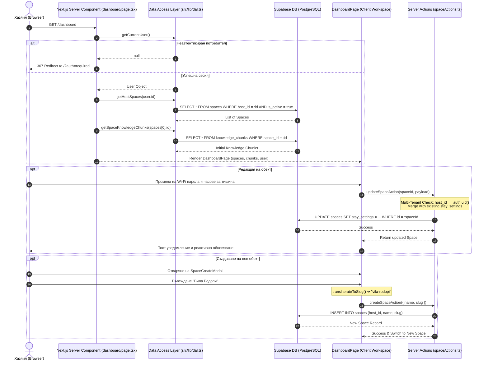

# Стъпка 6: Хазяин Дашборд (`/dashboard`) & Управление на пространствата

> **Статус**: 🟢 Завършена и слята в `main` (Merge commit `4e0adb3` от Pull Request #6)  
> **Дата на завършване**: 16 септември 2026 г.  
> **Дизайн & Архитектурни референции**: [`design/03_host_dashboard/DESIGN.md`](file:///d:/myProjects/smart_scan/design/03_host_dashboard/DESIGN.md), [`AGENTS.md`](file:///d:/myProjects/smart_scan/AGENTS.md) (Секции 1, 2, 4, 6), умение `nextjs-frontend`

---

## 1. Резюме на Стъпката

В Стъпка 6 реализирахме цялостния административен контролен панел за хазяи (**Host Dashboard**) в [`src/app/dashboard/page.tsx`](file:///d:/myProjects/smart_scan/frontend/src/app/dashboard/page.tsx) и [`src/features/dashboard/`](file:///d:/myProjects/smart_scan/frontend/src/features/dashboard/index.ts). Той предоставя интуитивно, бързо и защитено работно пространство за управление на имоти, правила за престоя, Wi-Fi настройки и знания за AI консиержа:

1. **Защита на ниво Server Component & DAL**:
   - Безрискова No-Middleware архитектура с директна проверка на сесията през Data Access Layer ([`getCurrentUser()`](file:///d:/myProjects/smart_scan/frontend/src/lib/dal.ts)).
   - Моментален сървърен редирект (HTTP 307 към `/?auth=required`) при опит за неавтентикиран достъп, гарантиращ нулев риск от изтичане на данни.
2. **Двуслойна йерархия на потребителския интерфейс ([`DashboardPage.tsx`](file:///d:/myProjects/smart_scan/frontend/src/features/dashboard/DashboardPage.tsx))**:
   - **Изглед 1: Списък на обектите (`SpaceSelector`)**: Обобщени метрики за профила ([`DashboardMetrics.tsx`](file:///d:/myProjects/smart_scan/frontend/src/features/dashboard/components/DashboardMetrics.tsx)), списък с активни вили/апартаменти ([`PropertyCard.tsx`](file:///d:/myProjects/smart_scan/frontend/src/features/dashboard/components/PropertyCard.tsx)) и интерактивен бутон/карта `+ Добави нов обект`.
   - **Изглед 2: Работно пространство за избран обект**: Горна навигационна лента с бутон за връщане ("Всички обекти"), 1-клик падащо меню за моментално превключване между обекти ([`SpaceSwitcher.tsx`](file:///d:/myProjects/smart_scan/frontend/src/features/dashboard/components/SpaceSwitcher.tsx)), и директен публичен линк към гост PWA (`/stay/[slug]`) с бутон за копиране и преглед в нов таб.
3. **Модал за създаване на ново пространство ([`SpaceCreateModal.tsx`](file:///d:/myProjects/smart_scan/frontend/src/features/dashboard/components/SpaceCreateModal.tsx))**:
   - Автоматична двупосочна кирилска транслитерация ([`transliterateToSlug`](file:///d:/myProjects/smart_scan/frontend/src/features/dashboard/utils/slugUtils.ts)) за мигновено и безопасно генериране на URL slug в реално време (напр. "Вила Родопи" ➔ `vila-rodopi`).
   - Клиентска и сървърна валидация за минимална дължина и уникалност.
4. **Интелигентен редактор на обекта ([`SpaceEditor.tsx`](file:///d:/myProjects/smart_scan/frontend/src/features/dashboard/components/SpaceEditor.tsx))**:
   - Строга визуална и логическа йерархия на полетата: Име ➔ URL Slug ➔ Адрес ➔ Wi-Fi данни (SSID и парола с 1-клик копиране) ➔ Часове за настаняване и напускане ➔ Код за сейф/врата ➔ Местно такси ➔ SOS спешен телефон.
   - Запазване на целостта на настройките: при частична актуализация съществуващите полета в `stay_settings` се запазват без загуба.
5. **Прецизен контрол на часовете за тишина ([`QuietHoursControl.tsx`](file:///d:/myProjects/smart_scan/frontend/src/features/dashboard/components/QuietHoursControl.tsx))**:
   - Поддръжка както на нощна тишина (напр. `23:00 – 08:00`), така и на традиционна следобедна сиеста (напр. `14:00 – 16:00`).
   - Бутон за цялостно изчистване и премахване на правилата при желание на хазяина.
6. **Управление на знания за AI консиержа ([`KnowledgeManager.tsx`](file:///d:/myProjects/smart_scan/frontend/src/features/dashboard/components/KnowledgeManager.tsx))**:
   - Стартови шаблони за теми ([`starterTopics.ts`](file:///d:/myProjects/smart_scan/frontend/src/features/dashboard/components/starterTopics.ts)) за бързо въвеждане (термостати, бойлер, паркинг, изхвърляне на боклук, домашни любимци).
   - Категоризиране (`wifi`, `rules`, `appliances`, `recommendations`, `general`, `access`, `parking`), преглед и изтриване на информационни карти.
7. **Защитни модали в стил GitHub**:
   - [`DeleteSpaceModal.tsx`](file:///d:/myProjects/smart_scan/frontend/src/features/dashboard/components/DeleteSpaceModal.tsx): Изисква точно изписване на името или слъга на обекта преди разрешаване на изтриването.
   - [`DeleteAccountModal.tsx`](file:///d:/myProjects/smart_scan/frontend/src/features/dashboard/components/DeleteAccountModal.tsx): Изисква въвеждане на пълния имейл на хазяина за пълно заличаване на профила и всички свързани ресурси.
8. **Сигурни сървърни действия (`Server Actions`)**:
   - [`spaceActions.ts`](file:///d:/myProjects/smart_scan/frontend/src/features/dashboard/actions/spaceActions.ts) и [`deleteAccountAction.ts`](file:///d:/myProjects/smart_scan/frontend/src/features/dashboard/actions/deleteAccountAction.ts) с твърди мулти-тенант проверки `host_id === user.id`.
9. **Пълна 10-езикова локализация (`next-intl`)**:
   - Всички етикети, бутони, подсказки и съобщения за грешки са локализирани на 10-те поддържани езика (`bg`, `en`, `de`, `el`, `es`, `fr`, `it`, `ro`, `ru`, `tr`).

---

## 2. Архитектура на потока и взаимодействията



---

## 3. Ключови компоненти и функционалности

### 1. Навигация & Профил ([`DashboardNavbar.tsx`](file:///d:/myProjects/smart_scan/frontend/src/features/dashboard/components/DashboardNavbar.tsx))
- **Лого & Бадж**: Лого на SmartScan Stay с индикация за текущата среда и брой активни обекти.
- **Езиков селектор**: Интегриран компонент [`LanguageSwitcher.tsx`](file:///d:/myProjects/smart_scan/frontend/src/features/landing/components/LanguageSwitcher.tsx) с флагове на 10 туристически държави.
- **Падащо потребителско меню ([`UserProfileDropdown.tsx`](file:///d:/myProjects/smart_scan/frontend/src/features/dashboard/components/UserProfileDropdown.tsx))**:
  - Показва имейл и име на хазяина;
  - Бутон за превключване към управление на акаунта;
  - Връзка към модала за изтриване на профил;
  - Сигурен бутон за изход (`signOut`), изчистващ сесийните бисквитки.

### 2. Работна зона за управление на обект ([`SpaceEditor.tsx`](file:///d:/myProjects/smart_scan/frontend/src/features/dashboard/components/SpaceEditor.tsx))
- **Име и слъг**: Позволява актуализация на наименованието и уникалния гост идентификатор.
- **Wi-Fi конфигурация**: Специализирана секция с бутон за копиране, валидация за празни полета и директна интеграция с гост картата.
- **График и правила**: Настаняване след, напускане преди, код за кутия за ключове (Keybox).
- **Спешни контакти & Такси**: Телефонен номер на хазяина, местна таксиметрова компания и SOS номер.
- **Тихи часове ([`QuietHoursControl.tsx`](file:///d:/myProjects/smart_scan/frontend/src/features/dashboard/components/QuietHoursControl.tsx))**:
  - Двойна поддръжка за нощна почивка и дневна сиеста.
  - Възможност за пълно нулиране/деактивиране без оставяне на празни или счупени стойности.

### 3. Интелигентно управление на базата от знания ([`KnowledgeManager.tsx`](file:///d:/myProjects/smart_scan/frontend/src/features/dashboard/components/KnowledgeManager.tsx))
- **Стартови теми ([`starterTopics.ts`](file:///d:/myProjects/smart_scan/frontend/src/features/dashboard/components/starterTopics.ts))**: Предварително дефинирани шаблони с икони за често срещани казуси в краткосрочните наеми:
  - *Климатик & Отопление*
  - *Топла вода & Бойлер*
  - *Паркиране & Гараж*
  - *Изхвърляне на отпадъци*
  - *Домашни любимци & Правила за двора*
- **Списък на картите**: Преглеждане на заглавие, категория и текстово съдържание с възможност за моментално изтриване.

### 4. GitHub-Style Защитни модали за деструктивни действия
- **[`DeleteSpaceModal.tsx`](file:///d:/myProjects/smart_scan/frontend/src/features/dashboard/components/DeleteSpaceModal.tsx)**: За предотвратяване на грешно изтриване на обект със стотици чатове и сканирания, бутонът "Изтрий обекта завинаги" се активира ЕДИНСТВЕНО след като хазяинът изпише точното име на пространството.
- **[`DeleteAccountModal.tsx`](file:///d:/myProjects/smart_scan/frontend/src/features/dashboard/components/DeleteAccountModal.tsx)**: Изисква хазяинът да въведе пълния си имейл адрес, за да потвърди окончателното заличаване на акаунта и всички негови пространства.

---

## 4. Сигурност, Мулти-тенант изолация & Достъпност (A11y)

### 1. No-Middleware сървърна защита (CVE-2025-29927)
Маршрутът `/dashboard` не разчита на уязвим `middleware.ts`. Всяка заявка се оценява в Server Component-а чрез [`src/lib/dal.ts`](file:///d:/myProjects/smart_scan/frontend/src/lib/dal.ts) с `server-only` директива. Неоторизирани клиенти получават 307 пренасочване преди рендирането на какъвто и да е HTML код.

### 2. Multi-Tenancy валидация в Server Actions
Във всички функции в [`spaceActions.ts`](file:///d:/myProjects/smart_scan/frontend/src/features/dashboard/actions/spaceActions.ts):
```typescript
const { data: space } = await supabase
  .from('spaces')
  .select('id, host_id')
  .eq('id', spaceId)
  .single();

if (!space || space.host_id !== user.id) {
  return { success: false, error: 'Нямате права за редакция на този обект.' };
}
```
Така е напълно невъзможно хазяин А да редактира, преглежда или изтрива имот на хазяин Б, дори при директно извикване на сървърния екшън с манипулиран UUID.

### 3. Достъпност (A11y) & UX детайли
- Всички интерактивни бутони притежават клас `cursor-pointer`.
- Всеки бутон и контролен елемент има динамичен `aria-label`, локализиран според избрания език.
- Използване на `useSyncExternalStore` и внимателно монтиране за елиминиране на грешки от тип `react-hooks/set-state-in-effect`.

---

## 5. Файлова структура на модул `dashboard`

```text
frontend/src/
├── app/
│   └── dashboard/
│       └── page.tsx                        # Server Component с DAL проверка на сесията
│
└── features/
    └── dashboard/
        ├── actions/
        │   ├── deleteAccountAction.ts      # Сигурно изтриване на профила на хазяина
        │   └── spaceActions.ts             # CRUD операции за spaces и knowledge_chunks
        ├── components/
        │   ├── DashboardMetrics.tsx        # Метрични карти (активни обекти, плакети, чатове)
        │   ├── DashboardNavbar.tsx         # Горен стики навбар за хазяина
        │   ├── DeleteAccountModal.tsx      # GitHub-style модал за изтриване на акаунт
        │   ├── DeleteSpaceModal.tsx        # GitHub-style модал за изтриване на обект
        │   ├── KnowledgeChunkList.tsx      # Списък със запазени знания
        │   ├── KnowledgeForm.tsx           # Форма за ръчно въвеждане на знание
        │   ├── KnowledgeManager.tsx        # Контейнер за базата от знания
        │   ├── PropertyCard.tsx            # Карта на имот в началния списък
        │   ├── QuietHoursControl.tsx       # Настройки за нощна почивка и сиеста
        │   ├── SpaceCreateModal.tsx        # Модал за нов обект с кирилска транслитерация
        │   ├── SpaceEditor.tsx             # Главен формуляр за данни на обекта
        │   ├── SpaceSelector.tsx           # Решетка за избор на обект
        │   ├── SpaceSwitcher.tsx           # Бърз превключвател в работната зона
        │   ├── UserProfileDropdown.tsx     # Падащо меню с профилна информация и изход
        │   └── starterTopics.ts            # Шаблони за бързи теми
        ├── types/
        │   └── dashboardTypes.ts           # Стриктни TypeScript типове (DashboardUser, Form states)
        ├── utils/
        │   └── slugUtils.ts                # transliterateToSlug с двупосочна кирилица
        ├── DashboardPage.tsx               # Главен интерактивен клиентски оркестратор
        └── index.ts                        # Публичен Barrel Export на модула
```

---

## 6. Верификация и резултати

| Компонент | Тест / Проверка | Резултат |
| :--- | :--- | :--- |
| **Сървърна защита на маршрута** | Опит за директен достъп до `/dashboard` без бисквитка | 🟢 HTTP 307 Redirect към `/?auth=required` |
| **TypeScript проверка** | `npx tsc --noEmit` във фронтенда | 🟢 0 типови грешки |
| **Фронтенд линтинг** | `npm run lint` (ESLint 9 + React 19) | 🟢 0 грешки, 0 предупреждения |
| **Production Build** | `npm run build` | 🟢 Успешно компилиран (Next.js Turbopack) |
| **Мулти-тенант сигурност** | Тест на Server Actions с манипулиран `space_id` | 🟢 Отказ с грешка за неоторизиран достъп |
| **Кирилска транслитерация** | Тест с имена като "Къща в гората", "Апартамент №5" | 🟢 Генерира валидни слъгове `kashta-v-gorata`, `apartament-5` |
| **CodeRabbit Review** | Автоматизиран цялостен одит на PR #6 | 🟢 Всички забележки за UX, a11y и сигурност са адресирани |
