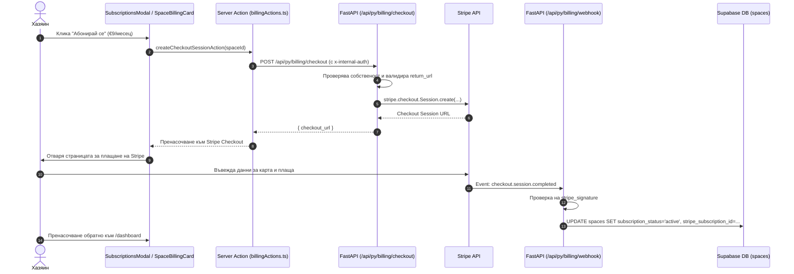
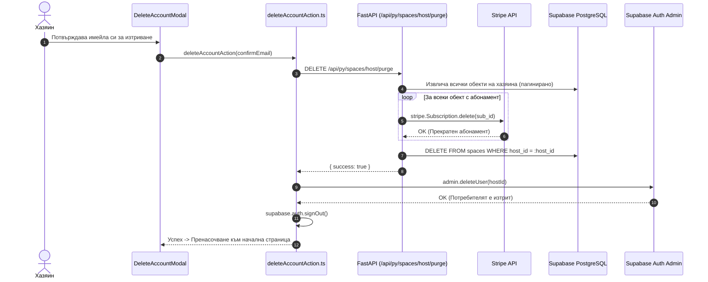

# Стъпка 9: Грануларно таксуване (Stripe Granular Billing) & Защита при изтриване на профил

> **Статус**: 🟢 Завършена  
> **Дата на завършване**: 27 септември 2026 г.  
> **PR-и в GitHub**: [#10 (Stripe Per-Space Billing)](https://github.com/Krasimir-Hristov/SmartScan/pull/10), [#11 (Billing UI Improvements & Safe Deletion)](https://github.com/Krasimir-Hristov/SmartScan/pull/11)  
> **Дизайн & Архитектурни референции**: [`design/07_billing_subscriptions/DESIGN.md`](../../design/07_billing_subscriptions/DESIGN.md), [`AGENTS.md`](../../AGENTS.md) (Секции 3, 5, 6, 7).  
> **Свързани документи**: [`ROADMAP.md`](../../ROADMAP.md) (Стъпка 9), [`docs/README.md`](../README.md).

---

## 1. Резюме на реализацията

В Стъпка 9 беше изградена цялостната финансова и абонаментна инфраструктура на **SmartScan Stay**, реализираща принципа за **грануларно таксуване на ниво обект (Per-Space Billing)**. За разлика от традиционните платформи с общ глобален абонамент за профила, SmartScan позволява на всеки хазяин да управлява абонамента, плащанията и сезонните паузи за всяка своя вила или апартамент напълно независимо.

В допълнение беше въведен жесток механизъм за сигурност срещу т.нар. **„Ghost Billing“ (призрачно таксуване)** при изтриване на обект или цялостно изтриване на профила на хазяина.

### Основни постижения

1. **Грануларно таксуване на ниво обект (`space_id`)**:
   - Всеки обект притежава собствен жизнен цикъл в Stripe (`stripe_subscription_id`, `stripe_customer_id`, `stripe_price_id`, `subscription_status`).
   - Модел на таксуване: **€9 / месец на обект** за `Stay` плана (`STRIPE_PRICE_ID_STAY`).
   - Поддръжка на 14-дневен безплатен пробен период (`trialing`, `trial_ends_at`) без предварително изискване на банкова карта.
   - Сезонен паузинг (*Summer/Winter Hold*) — хазяи с планински или морски имоти могат да паузират таксуването извън сезона през Stripe Customer Portal, запазвайки напълно въведените Wi-Fi пароли, наръчници и векторни знания безплатно.

2. **Интеграция със Stripe Checkout & Stripe Customer Portal**:
   - Автоматичен интелигентен преход:
     - Ако обектът е в пробен период без абонамент или е прекратен (`canceled`), бутонът отваря **Stripe Checkout Session**.
     - Ако обектът има регистриран абонамент или клиентски профил, бутонът отваря **Stripe Customer Portal Session**, където хазяинът управлява карти, сваля фактури с ДДС (EU Reverse Charge) или променя статуса.
   - Автоматично пренасочване обратно към дашборда на SmartScan след действие.

3. **Сигурен бекенд архитектурен слой (FastAPI + Stripe SDK)**:
   - Ендпойнти в `backend/app/features/billing/`:
     - `POST /api/py/billing/checkout` — създава Checkout сесия с валидация на собствеността върху обекта.
     - `POST /api/py/billing/portal` — създава сесия за Stripe Customer Portal.
     - `POST /api/py/billing/webhook` — обработва асинхронни събития от Stripe с криптографска проверка на сигнатурата.
   - Тайминг-безопасна автентикация през `x-internal-auth` с `hmac.compare_digest` срещу `BACKEND_PROXY_SECRET`.
   - Защита от **Open Redirect** атаки чрез Pydantic валидатор на `return_url`, ограничаващ пренасочванията само до разрешения списък с домейни (`FRONTEND_URL` и CORS origins).
   - Защита от претоварване с **SlowAPI** (`5 req / min`).
   - Идемпотентна обработка на Webhook събития с fallback по `metadata.space_id` при закъснели или разместени събития.

4. **Централизиран модал за абонаменти (`SubscriptionsModal.tsx`)**:
   - Достъпен от потребителското меню в навигацията (`UserProfileDropdown`).
   - Показва списък на всички имоти на хазяина с актуалния им статус (`Active`, `Trialing`, `Paused`, `Past Due`, `Canceled`), месечната такса (€9/месец) и директни бутони за управление.
   - Пълна достъпност (Accessibility): React Portal в `document.body`, WAI-ARIA атрибути (`role="dialog"`, `aria-modal="true"`), затваряне с `Escape` и двупосочен Focus Trap за клавиатурна навигация с `Tab`.

5. **Защитен протокол срещу Ghost Billing & Account Purge**:
   - Ендпойнт `DELETE /api/py/spaces/host/purge` с детерминистично пагиниране на обектите (`order("id").range(...)`).
   - Гаранция за нулев финансов теч: при заявка за изтриване на профил системата първо задължително канселира всички активни абонаменти в Stripe API. Ако възникне грешка в Stripe, процесът се прекъсва аварийно, предотвратявайки триене на акаунта докато текат парични трансакции.
   - Безопасно единично изтриване на обект (`DELETE /api/py/spaces/{space_id}`): автоматично канселира асоциирания Stripe абонамент и разкача идентификатора (`deleted_{stripe_sub_id}`) преди премахването от базата.
   - Сървърната акция `deleteAccountAction.ts` координира целия цикъл: Backend Purge ➔ Админско триене в Supabase Auth (`supabaseAdmin.auth.admin.deleteUser`) ➔ Изчистване на бисквитките и сесията.

6. **10-езикова локализация (i18n)**:
   - Всички надписи, статуси, съобщения за грешки и бутони са преведени на 10-те поддържани езика: `bg`, `en`, `de`, `el`, `es`, `fr`, `it`, `ro`, `ru`, `tr`.

---

## 2. Архитектура на компонентите и файлова структура

```text
backend/
├── app/
│   ├── core/
│   │   └── config.py                     # Stripe ENV настройки (STRIPE_SECRET_KEY, STRIPE_WEBHOOK_SECRET, etc.)
│   └── features/
│       ├── billing/
│       │   ├── router.py                 # FastAPI ендпойнти: /checkout, /portal, /webhook
│       │   ├── schemas.py                # Pydantic v2 входни DTOs с валидация срещу Open Redirect
│       │   └── service.py                # Stripe SDK бизнес логика, проверка на права, Webhook обработка
│       └── spaces/
│           ├── router.py                 # DELETE /{space_id} и DELETE /host/purge
│           └── service.py                # Безопасно канселиране на абонаменти и изтриване на обекти
│
frontend/
├── messages/                             # i18n преводи на 10 езика (billing ключове)
│   ├── bg.json, en.json, de.json, el.json, es.json...
├── src/
│   ├── features/
│   │   └── dashboard/
│   │       ├── actions/
│   │       │   ├── backendClient.ts      # Сървърен fetch клиент с x-internal-auth и x-user-id
│   │       │   ├── billingActions.ts     # Next.js Server Actions: createCheckoutSession, createCustomerPortal
│   │       │   ├── deleteAccountAction.ts# Координирано изтриване на профил (Purge ➔ Supabase Auth)
│   │       │   └── spaceActions.ts       # Управление и изтриване на обекти
│   │       ├── components/
│   │       │   ├── SubscriptionsModal.tsx# Модал с преглед на абонаментите за всички обекти
│   │       │   ├── SpaceSelector.tsx     # Табове на обектите с динамични цветни баджове за абонамент
│   │       │   ├── UserProfileDropdown.tsx# Меню на профила с вход към SubscriptionsModal и Delete Account
│   │       │   └── space-editor/
│   │       │       └── SpaceBillingCard.tsx # Карта за управление на абонамента в редактора на конкретен обект
│   └── lib/
│       └── types/
│           └── databaseTypes.ts          # Разширен интерфейс за Space с stripe_customer_id
│
supabase/
└── migrations/
    └── 20260925000001_add_stripe_customer_id_to_spaces.sql # Добавяне на stripe_customer_id и индекс
```

---

## 3. Схема на потоците на данни (Data Flow)

### А. Активиране на абонамент през Stripe Checkout



### Б. Безопасно изтриване на профил (Anti-Ghost Billing Purge)



---

## 4. Ключови инварианти и правила за сигурност

1. **Никога не изтривай обект или профил преди да си прекратил абонамента в Stripe**:
   - Ако потребител изтрие профила си, Stripe ще продължи да таксува кредитната карта ежемесечно, ако абонаментът не е затворен.
   - Протоколът `purge_host_account` гарантира атомарно прекратяване в Stripe преди триенето на данните в Postgres.
2. **Timing-Safe Auth Verification**:
   - Вътрешните заявки между Next.js сървъра и FastAPI бекенда ползват `hmac.compare_digest` за сравняване на споделената тайна (`BACKEND_PROXY_SECRET`), предотвратявайки side-channel атаки.
3. **Строга защита от Open Redirect**:
   - Никакви външни непознати адреси не се допускат в `return_url`. Допустими са единствено адреси, чиито `origin` съвпада с `FRONTEND_URL` или CORS белия списък.
4. **Idempotency и Fallback при Webhook събития**:
   - Webhook обработчикът разчита както на директно съвпадение по `stripe_subscription_id`, така и на `metadata.space_id` при възможни размествания във времето на получаване на събитията.
5. **WAI-ARIA и Keyboard Trap**:
   - Модалите за абонаменти и потвърждение винаги управляват фокуса коректно, предотвратявайки излизане на фокуса извън диалога при натискане на `Tab`.

---

## 5. Верификация и резултати от тестовете

1. **TypeScript Проверка**:
   - `npx tsc --noEmit` в директория `frontend/` завършва с **0 грешки**.
2. **ESLint 9 Одит**:
   - `npm run lint` във `frontend/` преминава с **0 грешки** и **0 предупреждения**.
3. **Next.js 16 Production Build**:
   - `npm run build` се компилира успешно с пълен статичен и динамичен анализ на страниците.
4. **FastAPI & Python Качество**:
   - Изпълнени `ruff check .` и `mypy app` в `backend/` с **0 грешки**.
   - Всички тестове в `backend/tests/` преминават успешно (`pytest`).
5. **CodeRabbit Одит**:
   - Всички препоръки от CodeRabbit за PR #10 и PR #11 бяха адресирани (валидация на return_url, обработка на късни уебхукове, фокус трап при неактивни контроли, детерминистично сортиране при пагинация).
6. **Ръчни тестове в Stripe Test Mode**:
   - Успешно преминаване през пълен Stripe Checkout цикъл с тестова карта 4242...
   - Моментално активиране на обекта в зелен статус (`Active`) след получаване на уебхука.
   - Отваряне на Stripe Customer Portal, промяна на данни и сваляне на фактура.
   - Тестване на сезонно паузиране и успешно възстановяване на абонамента.
   - Тестване на пълно изтриване на профил — потвърдено прекратяване на абонамента в Stripe Dashboard преди изтриване на потребителя от Supabase.
